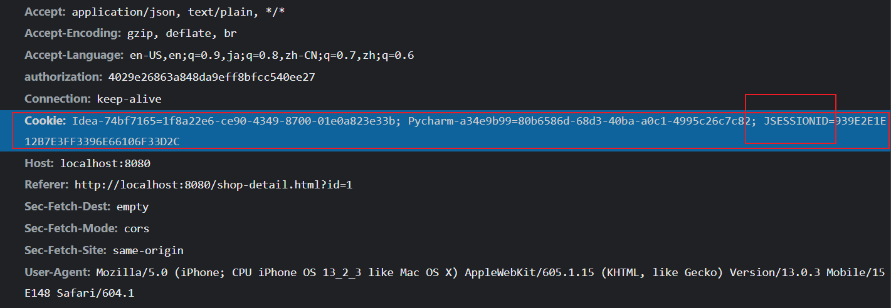
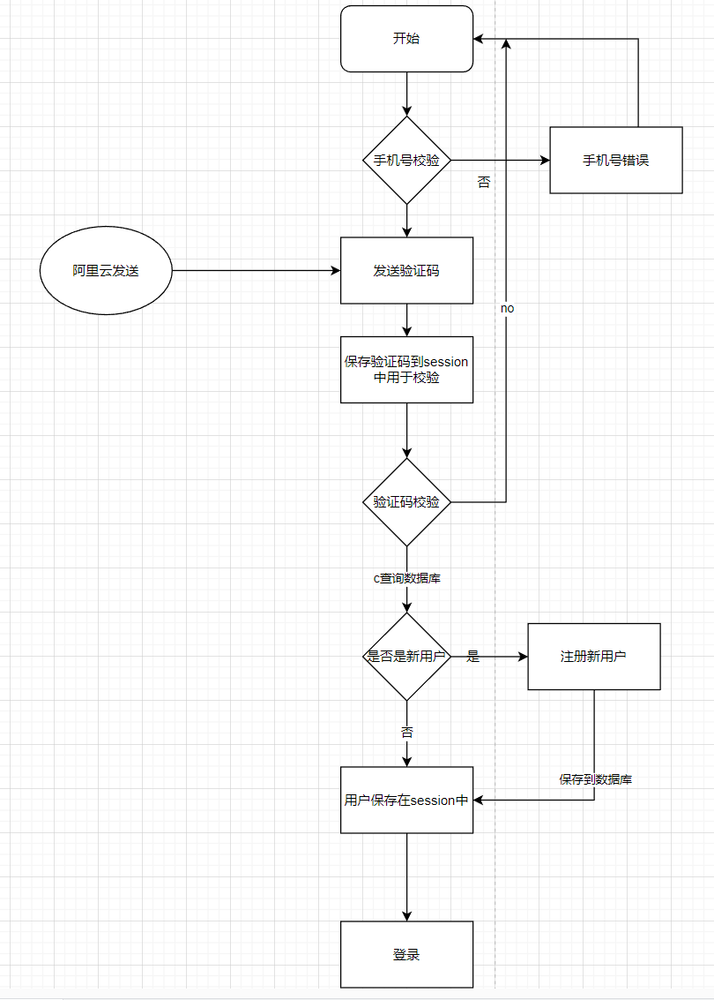
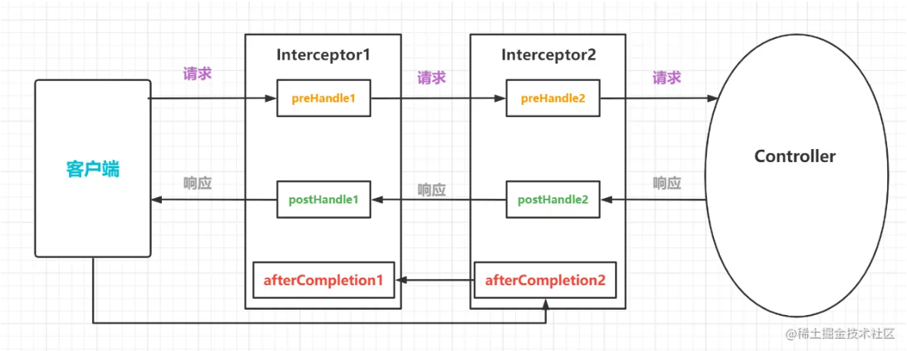
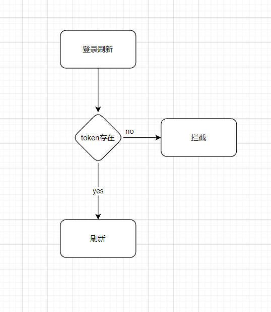

## JsessionId 是什么

> Jsessionid 指的是 sessionid，Tomcat 中生成的就是叫做 jsessionid

浏览器第一次访问服务器会在 tomcat 服务器 HttpServletRequest 的 getSession(true)的时候创建 session（浏览器的相关信息） 并存在服务器中，tomcat 的 ManagerBase 类提供创建 sessionid 的方法：随机数+时间+jvmid；客户端只保存 sessionid 也就是 Jsessionid 到 cookie
，同时 session 销毁只能通过 invalidate 或超时，关掉浏览器并不会关闭 session

#### ServletContext、HttpSession 和 HttpServletRequest 的区别和联系

Context 域 > Session 域 > Request 域
Session 域 只要会话不结束就会存在 但是 Session 有默认的存活时间(30 分钟)
HttpServletRequest 作用范围是整个请求链（请求转发也存在）；生命周期是在 service 方法调用前由服务器创建，传入 service 方法。整个请求结束，request 生命结束。

1. ServletContext：范围最大,应用程序级别的,整个应用程序都能访问；
2. HttpSession–次之,会话级别的，在当前的浏览器中都能訪问\[不论是在同一浏览器开多少窗体，都能够访问],可是换个浏览器就不行了，
   就必须又一次创建 session；
3. HttpServletRequest–范围最小,请求级别,请求结束,变量的作用域也结束【也就是仅仅是一次访问,访问结束，这个也结束】。

## 短信登录流程

### 拦截器

相对于过滤器而言，拦截器要的控制更加的细节，拦截器可以在三个地方进行执行。

1. 可以在请求到达 Controller 控制器之前 通过拦截器执行一段代码
2. 也可以在控制器执行之后，通过拦截器执行一段代码 【此时只是 Controller 执行完毕 视图还没有开始渲染也就是跳转之前】
3. 最后在整个请求结束的时候页面跳转完成还可以通过拦截器执行一段时间代码

是 AOP 面向切片编程的体现
作用：
日志记录：记录请求信息的日志，以便进行信息监控、信息统计、计算 PV（Page View）等；
权限检查：如登录检测，进入处理器检测是否登录；
性能监控：通过拦截器在进入处理器之前记录开始时间，在处理完后记录结束时间，从而得到该请求的处理时间。（反向代理，如 Apache 也可以自动记录）
通用行为：读取 Cookie 得到用户信息并将用户对象放入请求，从而方便后续流程使用，还有如提取 Locale、Theme 信息等，只要是多个处理器都需要的即可使用拦截器实现。

## 登录刷新

设置一个 token 刷新拦截器 用户发送请求 通过 session 得到 token 查询 redis 只要用户存活就进行登录刷新

## 缓存不一致问题

数据库更新后缓存也要更新 将缓存删除 在用户查询时在写入缓存保持更新

## 秒杀问题

一人一单问题：
集群中本地锁会失效。利用 redis 的特点进行分布式锁的使用
Redis 利用 setnx 实现加锁效果，并设置超时删除；
但是加锁和删除非原子操作，当加锁成功后 服务器遇见问题 不能删除会出现<u>死锁情况</u>

同时删除锁时候 需要判断是不是自己上的锁 检查当前的锁和线程的锁是否一致
