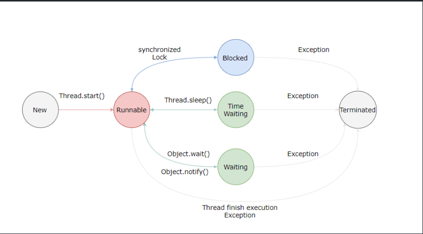

## 线程基础

### 线程状态

初始，可运行(分为拿到了 cpu 资源或者等待 cpu 时间片对应于操作系统的运行和就绪态)，阻塞（等待获取锁资源），无限等待（等待其它线程显式地唤醒，否则不会被分配 CPU 时间片），有限等待（超时自动唤醒），终止

> 关于线程等待 Thread.sleep(time)常用一个`线程睡眠`进行描述
> Object.wait() 线程进入等待或者无限等待状态 常用`线程挂起`进行描述
> 睡眠和挂起描述的是行为，阻塞和等待描述的是状态
> 阻塞是被动的而等待是主动的

### 线程常用方法

- sleep( ) 和 wait( ) 的这 5 个区别
  Thread.sleep()不会释放锁资源，Object.wait()会释放锁资源
  sleep 必须传入时间，时间到自动苏醒
  wait 可以不传入时间表示一直阻塞直到 notify 进行唤醒，带时间会自动苏醒当苏醒后立即获得锁便继续执行，否则进入到等待队列中去。
  sleep() 方法没有释放锁，而 wait() 方法释放了锁
  wait() 方法被调用后，线程不会自动苏醒，需要别的线程调用同一个对象上的 notify()，sleep 会自动苏醒
- yield()
  告诉调度器，当前线程愿意放弃 cpu
- interrupt() 调用线程的 interrupt() 方法会设置线程的中断标记，中断标记的作用在于向目标线程发出 中断请求，告知该线程需要停止执行当前任务，并在合适的时机终止执行。它是一种协作机制，用于线程之间的协调和通信。调用 interrupt 不会立即中断线程，只标记当前线程为中断状态，在合适的时机进行实际中断。
  > 因此可以在循环体中使用 interrupted() 方法来判断线程是否处于中断状态，从而提前结束线程。

### 线程和进程的区别

进程：进程是代码在数据集合上的一次运行活动，是系统进行资源分配和调度的基本单位。
线程：线程是进程的一个执行路径，一个进程中至少有一个线程，多个线程共享进程资源。

### 启动线程的方式

继承 Thread 类或者实现 Runable 接口可以重写 run 方法实现线程主体
实现 Callable 接口 需要实现 call 方法实现线程主体，并且可以借助 Future 接口返回线程的执行结果和异常
使用 start（）在处理器中注册线程并执行 run 方法
若只执行 run 方法会相当于执行了 Main 函数的一个方法体 并没有启动真正意义的新的线程。

---

### Volatile 是轻量级同步机制

Volatile 是轻量级同步机制，保证可见性，禁止指令重排、不保证原子性

> 1. 指令重排序：
>    对象分配的过程：1. 分配内存空间即 new 关键字执行 2. 初始化对象即执行构造函数 3. 将对象的引用指向分配的内存空间，即通过 *.*访问对象属性和方法
>    其中 2 和 3 的顺序可以颠倒，致使未初始化的对象引用暴露出来。
> 2. 保证可见性：当变量被 Volatile 修饰后，对一个 Volatile 变量的读，总能看到任意线程对于 Volatile 变量的最后的写入。
> 3. 原子性：
>    单个的 volatile 变量的读写具有原子性，但复合操作不具有。

- 禁止指令重排： 在对这个变量进行读写操作的时候，会通过插入特定的 内存屏障 的方式来禁止指令重排序。

- 如何保证可见性
  volatile 在写操作执行之前会出发 lock 前缀指令。

  1. 将当前处理器中的数据写回到系统内存中去。利用缓存锁定，根据缓存一致性机制阻止多个处理器修改同一内存数据。
  2. 一个处理器的缓存回写到内存会导致其他处理器的缓存无效.

> 处理器数据先从内存中进入到缓存中去，并不直接操作内存 这样提高数据的处理速度。
>
> 1.  总线锁
>     当一个处理器在总线上输出此信号时，其他处理器的请求将被阻塞住，那么该
>     处理器可以独占共享内存。
> 2.  缓存锁： 阻止同时修改由两个以上处理器缓存的内存区域数据

- 不能保证原子性：对于复合操作不能保证原子性

### Volatile 的内存规则和行为

- 写：
  写入一个 volatile 变量后，会将改线程本地内存中的该变量值刷新到共享内存中去
- 读：
  读取一个 volatile 变量，会将本地内存中的该变量旧值设置为无效，并从共享内存中去读取新值。
  通过借助共享内存给桥梁，实现了两个线程之间的通信，保证了读线程能够及时看到写线程对共享变量的修改。

> 锁释放与 volatile 写有相同的内存语义；锁获取与 volatile 读有相同的内存语义
> CAS 操作同时具备 volatile 读和 volatile 写的内存语义，即 CAS 读取共享数据时的过程和 volatile 读过程相同，总是将共享变量读取到内存中去，从而读取到最新值。CAS 的修改数据也会将数据刷新到共享内存中去。

---
