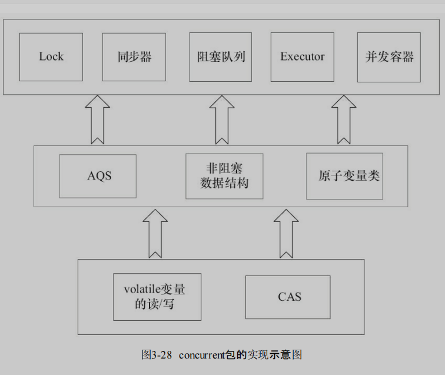
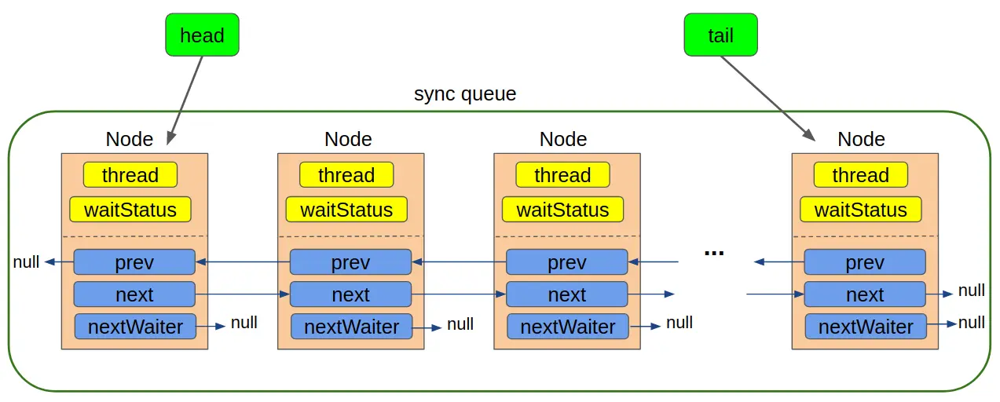

# JUC 源码阅读

JUC 指的是 Java Util Concurrency，即 Java 工具包下的并发工具类库（Java Util Concurrency Utilities）。JUC 提供了一系列用于并发编程的工具类、接口和工具方法，帮助开发者更容易地实现多线程程序，并提供了更高级别、更灵活、更高效的并发编程解决方案。


### JUC 的原子类

java 原子类本质上使用的是 CAS，而 CAS 底层是通过 Unsafe 类实现的。所以本章将对 CAS, Unsafe 和原子类详解

#### CAS

对比交换，是一条 cpu 原子指令，解释为：CAS 操作输入一个操作前的旧值和想要更新的新值，在操作期间若旧值没有变化，则更新，否则不更新。也因为 CAS 是原子操作，并发时不需要使用锁，也因为是无锁机制，cas 是乐观锁的一种。
**CAS 三大问题**

- CAS 的 ABA 问题
  CAS 检查旧值无法判断旧值的变化次数，假如旧值 A 在检查前变为 B 又变为 A，CAS 无法知道旧值已经发生了变化。对于次，我们可以添加版本号，每次变量更新时都将版本号+1
- 循环时间长开销大
  自旋情况下回消耗 cpu 资源
- 只能保证一个共享变量的原子操作
  是对多个共享变量操作时，循环 CAS 就无法保证操作的原子性，这个时候就可以用锁

#### 自旋锁 VS 适应性自旋锁

为什么需要自旋锁：锁在切换线程过程中，需要对线程进行阻塞或者唤醒，这中间需要 cpu 状态切换完成，资源消耗非常明显，而对于锁定时间很短的同步资源而言，利用系统级的阻塞和唤醒花费的时间要明显大于其锁定时间，因此在多处理器中我们让想要获取锁的线程稍微等待一下，不要进入阻塞状态而继续占有 cpu，让占有锁的线程释放锁之后去直接获取锁。
这其中的“等待一会”便是线程的自旋操作，但自旋也有时间限制，要求要小于系统对线程切换的时间，防止得不偿失，白白占用 cpu 资源，一般当自旋超过 10 次（默认）便需要考虑阻塞。

适应性自旋锁：为了更灵活的使用自旋锁，减少在占有锁的进程中在自旋进程刚刚自旋完就释放锁的情况，自适应自旋锁将根据上一次锁自旋时间和对应锁占有者释放情况控制当前锁自旋次数。若上一次成功获得过锁，会增加自旋次数，反之认为获得锁的概论小而减少自旋时间。

### unsafe 类

位于 sun.misc 包中，提供了一些底层操作的方法，允许直接操作内存和执行一些不安全的操作。这个类是 JDK 内部使用的，并不是公开 API，因此并不建议在生产代码中直接使用它，因为它可能会导致不确定的行为并且不具有跨平台性。

## LockSupport 源码

为什么要看： JUC 最重要的类---同步队列器的实现基础是 LockSupport

```java
/**
 * park方法
 * */
    public static void park(Object blocker) {
        Thread t = Thread.currentThread();
        setBlocker(t, blocker);
        UNSAFE.park(false, 0L);
        setBlocker(t, null);
    }

// unpark方法 blocker 是一个线程对象，用于标识当前线程被阻塞的原因
     public static void park(Object blocker) {
        Thread t = Thread.currentThread();
        setBlocker(t, blocker);
        UNSAFE.park(false, 0L);
        setBlocker(t, null);
    }
//阻塞多长毫秒
    public static void parkNanos(Object blocker, long nanos) {
        if (nanos > 0) {
            Thread t = Thread.currentThread();
            setBlocker(t, blocker);
            UNSAFE.park(false, nanos);
            setBlocker(t, null);
        }
    }
    //阻塞到某一时间点
     public static void parkUntil(Object blocker, long deadline) {
        Thread t = Thread.currentThread();
        setBlocker(t, blocker);
        UNSAFE.park(true, deadline);
        setBlocker(t, null);
    }

//查看线程被阻塞的原因 如果park()参数中带了blocker的话
 public static Object getBlocker(Thread t) {
        if (t == null)
            throw new NullPointerException();
        return UNSAFE.getObjectVolatile(t, parkBlockerOffset);
    }


```

其中的 park（） 和 unpark（Thread) 方法分别是阻塞和解除阻塞线程，其中的 permit 看作 0 和 1，默认为 0；

1. park() 线程设置为阻塞状态，permit 置 0，若 permit 大于 0 则消耗一个 permit,不能重复消耗即 permit 最小为 0
2. unpark(Thread) 线程设置为解除阻塞状态，permit 值 1，不能重复增加，即最大为 1
   若方法中的 permit>0 不阻塞 ， =0 阻塞

## park/unpark 与 wait/notify 的区别

1. wait 和 notify 一般按照顺序出现，即先 wait 再唤醒。park/unpark 没有先后顺序要求
2. LockSupport 允许在任意地方阻塞唤醒线程，Object 的 wait/notify 必须在 synchronized 同步代码块内调用。
   因为 park/unpark 依赖许可量，wait/notify 依赖锁。LockSupport 允许唤醒指定线程，notify 只能唤醒随机线程，notifyAll 唤醒全部阻塞线程。

## AQS

研究并发工具的三个重要点:状态，队列，CAS,在于解决了并发编程中常见的状态管理、线程安全以及同步

- 状态：共享资源的状态管理
- 队列：使用队列来管理等待获取资源的线程
- CAS: CAS 操作是最轻量的并发处理，通常我们对于状态的修改都会用到 CAS 操作，因为状态可能被多个线程同时修改，CAS 操作保证了同一个时刻，只有一个线程能修改成功，从而保证了线程安全。
  > AQS 核心思想是，如果被请求的共享资源空闲，则将当前请求资源的线程设置为有效的工作线程，并且将共享资源设置为锁定状态。如果被请求的共享资源被占用，那么就需要一套线程阻塞等待以及被唤醒时锁分配的机制，这个机制 AQS 是用 CLH 队列锁实现的，即将暂时获取不到锁的线程加入到队列中。
- CLH
  这其中的队列便是 CLH，是一种 FIFO（先进先出）的等待队列。
  在 CLH 队列中，每个等待线程都持有一个自旋锁，当资源释放时，队列的头部线程可以立即获得资源，其他线程按照 FIFO 的顺序进行自旋等待，避免了线程间的竞争。
  > 理解起来便是，CLH 类似饭店排队的队列，其中每个人都有自己的号牌，即自己的等待时间，按照先来后到的顺序进行等待避免竞争。

### 源码

```java
/**
 * 该属性的值即表示了锁的状态，state为0表示锁没有被占用，state大于0表示当前已经有线程持有该锁，这里之所以说大于0而不说等于1是因为可能存在可重入的情况。你可以把state变量当做是当前持有该锁的线程数量。
 * */
private volatile int state;//共享变量，使用volatile修饰保证线程可见性

//返回同步状态的当前值
protected final int getState() {
        return state;
}

 // 设置同步状态的值
protected final void setState(int newState) {
        state = newState;
}

//原子地(CAS操作)将同步状态值设置为给定值update如果当前同步状态的值等于expect(期望值)
protected final boolean compareAndSetState(int expect, int update) {
        return unsafe.compareAndSwapInt(this, stateOffset, expect, update);
}


```

AQS 支持默认的独占模式和共享模式。在独占模式下，其他线程无法获取锁，而在共享模式下，多个线程可以获取资源

- 独占模式：同一时刻锁只能被一个线程锁占有，可以通过 state 的值进行判断是否被占用，state>0 被占有。

**如何知道被占用的线程是哪个**
AQS 主要提供了 exclusiveOwnerThread 属性来记录当前持有锁的线程，但是没有提供一个公开的方法来获取占用资源的线程。

> AQS 的设计模式：模板方法，它定义了一个算法的框架，将算法的实现步骤延迟到子类中，基本形式是写好抽象类，包含抽象方法，子类实现抽象方法。

> 实现抽象方法后子类若不实现所有父类的抽象方法，子类依旧是继承父类的抽象方法的抽象类，但是若父类有默认的实现方法那么不重写不不会报错。

要自定义同步器需要实现以下的方法

```java
isHeldExclusively()//该线程是否正在独占资源。只有用到condition才需要去实现它。
tryAcquire(int)//独占方式。尝试获取资源，成功则返回true，失败则返回false。
tryRelease(int)//独占方式。尝试释放资源，成功则返回true，失败则返回false。
tryAcquireShared(int)//共享方式。尝试获取资源。负数表示失败；0表示成功，但没有剩余可用资源；正数表示成功，且有剩余资源。
tryReleaseShared(int)//共享方式。尝试释放资源，成功则返回true，失败则返回false。

```

其他方法都是 final 修饰不能修改。

> 以 ReentrantLock 为例，state 初始化为 0，表示未锁定状态。A 线程 lock()时，会调用 tryAcquire()独占该锁并将 state+1。此后，其他线程再 tryAcquire()时就会失败，直到 A 线程 unlock()到 state=0(即释放锁)为止，其它线程才有机会获取该锁。当然，释放锁之前，A 线程自己是可以重复获取此锁的(state 会累加)，这就是可重入的概念。但要注意，获取多少次就要释放多么次，这样才能保证 state 是能回到零态的。

### CLH 队列

同步队列，代表所有的等待线程的集合，通过将每一个请求共享资源的线程封装为 node ，并将 node 之间的关系构成虚拟双向列表,实现对锁的分配

- node 结构

由于是双向虚拟节点，每个节点包含了节点的前驱和后继，同时队列有头节点和尾节点,同时包含了一个 nextWaiter 节点代表了当前节点的等待状态，且独占模式下 nextWaiter==null。


node 的构造方法如下：每个节点包含 Thread 的引用，以及标识当前线程的状态

```java
  Node() {    // Used to establish initial head or SHARED marker
        }

        Node(Thread thread, Node mode) {     // Used by addWaiter
            this.nextWaiter = mode;
            this.thread = thread;
        }

        Node(Thread thread, int waitStatus) { // Used by Condition
            this.waitStatus = waitStatus;
            this.thread = thread;
        }
```

一个` volatile int waitStatus;`标识 node 在队列中的状态
| 状态 | 含义 |值|
|--------------|-------|----|
| CANCELLED | 当前线程已被取消，在等待队列中无效 |1|
| SIGNAL | 当前线程的后继线程节点处于等待状态，当前节点释放或取消时通知后继节点 |-1|
| CONDITION | 表示当前节点在等待 condition，也就是在 condition 队列中 |-2|
| PROPAGATE | 作用于共享模式，释放锁时需要唤醒后续节点 |-3|

> 当 waitStatus==0 表示当前节点在 sync 队列中，等待着获取锁
> 在独占锁中关注 CANCELLED SIGNAL 两种状态，

- 锁的获取
  该方法以独占模式获取(资源)，忽略中断，获取失败则排队
  > addWaiter(Node.EXCLUSIVE)中 Node.EXCLUSIVE == null 为独占标记

```java
public final void acquire(int arg) {
        if (!tryAcquire(arg) &&
            acquireQueued(addWaiter(Node.EXCLUSIVE), arg))
            selfInterrupt();
    }
```

- tryAcquire(arg) 获取锁的具体过程，子类需要实现自己的逻辑
- addWaiter(Node.EXCLUSIVE) 将获取阻塞的线程封装为 node 进行排队，插入到队列尾部

```java
 private Node addWaiter(Node mode) {
        Node node = new Node(Thread.currentThread(), mode);
        // Try the fast path of enq; backup to full enq on failure
        //插入到尾节点后
        Node pred = tail;
        if (pred != null) {
            node.prev = pred;
            if (compareAndSetTail(pred, node)) {
                pred.next = node;
                return node;
            }
        }
        //如果sync queue队列还没有初始化，则会使用enq插入队列中
        enq(node);
        return node;
    }

```

- acquireQueued(final Node node, int arg) 在独占模式下让线程在队列中不断尝试获取锁

```java
  final boolean acquireQueued(final Node node, int arg) {
        boolean failed = true;
        try {
            boolean interrupted = false;
            for (;;) {
                //无限循环
                //获取当前节点的前驱
                final Node p = node.predecessor();
                //前驱为头节点且能够获取到锁，将头节点设置为当前节点
                if (p == head && tryAcquire(arg)) {
                    setHead(node);
                    p.next = null; // help GC
                    failed = false;
                    //返回false，表示等待过程中未出现中断
                    return interrupted;
                }
               // 否则，调用shouldParkAfterFailedAcquire和parkAndCheckInterrupt方法
                if (shouldParkAfterFailedAcquire(p, node) &&
                    parkAndCheckInterrupt())
                    interrupted = true;
            }
        } finally {
            //获取锁失败，取消获取 将当前节点状态设置为cancel
            // 这里获取失败有两种情况 即上面的if (p == head && tryAcquire(arg))不满足
            if (failed)
                cancelAcquire(node);
        }
    }
```

> finally 代码块最终都会执行，若 return 在 try 内部那么 finally 会在返回之前执行。

shouldParkAfterFailedAcquire（）用于判断当前线程是否应该在获取同步状态失败后被阻塞

```java
//用于判断当前线程是否应该在获取同步状态失败后被阻塞，只有前驱为signal状态才能进行park
private static boolean shouldParkAfterFailedAcquire(Node pred, Node node) {
        int ws = pred.waitStatus;
        //前驱节点的状态为Node.SIGNAL表示前驱想要释放即已经调用了unpark
        if (ws == Node.SIGNAL)
            /*
             * This node has already set status asking a release
             * to signal it, so it can safely park.
             */
            return true;
            //前驱节点被取消，找到最近的不是cancel的节点并连接为前驱。
        if (ws > 0) {
            /*
             * Predecessor was cancelled. Skip over predecessors and
             * indicate retry.
             */
            do {
                node.prev = pred = pred.prev;
            } while (pred.waitStatus > 0);
            //去掉了最近的状态为cancel节点的前驱
            pred.next = node;
        } else {
            /*
             * waitStatus must be 0 or PROPAGATE.  Indicate that we
             * need a signal, but don't park yet.  Caller will need to
             * retry to make sure it cannot acquire before parking.
             */
            //这里的前驱==0 将前驱节点设置为signal
            compareAndSetWaitStatus(pred, ws, Node.SIGNAL);
        }
        return false;
    }

//阻塞并检查中断
        private final boolean parkAndCheckInterrupt() {
        LockSupport.park(this);
        return Thread.interrupted();
    }
```

> 这里为什么前驱节点调用了 unpark 还需要阻塞当前节点，因为锁的获取需要通过 tryAcquire 来实现，unpark 并不立即释放锁 ，而是告诉后面节点已经有释放锁的信号了。

对于 AbstractQueuedSynchronizer 的分析，最核心的就是 sync queue 的分析。

1. 每一个结点都是由前一个结点唤醒
2. 当结点发现前驱结点是 head 并且尝试获取成功，则会轮到该线程运行。
3. condition queue 中的结点向 sync queue 中转移是通过 signal 操作完成的。
4. 当结点的状态为 SIGNAL 时，表示后面的结点需要运行。
   '
   > 参考：
   >
   > 1. https://pdai.tech/md/java/thread/java-thread-x-lock-AbstractQueuedSynchronizer.html#%E7%B1%BB%E7%9A%84%E6%A0%B8%E5%BF%83%E6%96%B9%E6%B3%95-acquire%E6%96%B9%E6%B3%95
   > 2. https://segmentfault.com/a/1190000015739343#item-5-10
