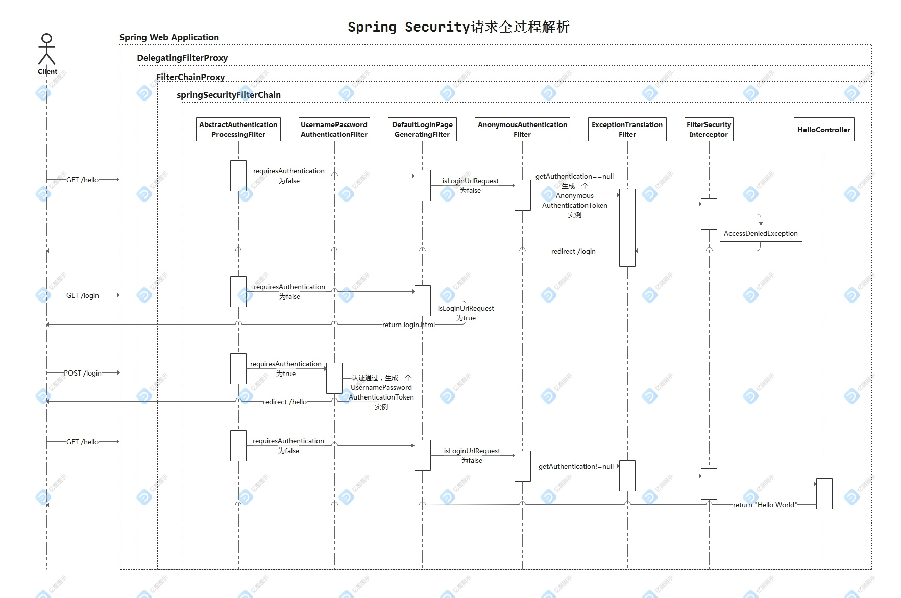

## SpringSecurity 整合 JWT 的目的

提供无状态登陆的机制

## Session、Cookie 与 Token

## JWT

JWT（JSON Web Token）是一种开放标准（RFC 7519），用于在两方之间安全传输信息。它主要通过在信息中嵌入经过签名的 JSON 对象来实现安全的数据传输。JWT 通常用于身份验证和在网络应用之间安全地传递声明信息。

- JWT 的组成
  由三部分组成，这三部分通过点号（.）连接在一起
  Header.Payload.Signature

> 注意：JWT 不加密，仅使用签名保证数据的完整性和真实性。因此，敏感信息不应该存储在 JWT 中，而应该在安全通道中传输

## 功能设计

登陆流程：
用户输入用户名、密码、验证码进行登陆。首次校验后浏览器保存 jwt 信息，以后登陆都可以携带 JWT 进行校验。
而由于 HTTP 的无状态特点，当 A 用户进行验证码登陆需要保证他输入 B 用户的验证码不能成功登陆，那么如何验证 A 用户的身份呢。
在后端生成随机数，并将随机数和对应的验证码作为 key-value 键值对形式进行存储，然后将生成的随机数返回给前端，前端在登录请求时将该随机数以及用户输入的验证码传给后端，后端就能通过该随机数进行查询，校验输入的验证码和正确验证码是否一致。我们可以引入 redis 中间件来完成随机数和验证码的存储，因为一个验证码对应一个用户的一次登录过程，所以当验证成功时，我们将 redis 中存储的验证码和随机码删除，采用这种方式也不会消耗多少存储空间。

## Spring Security 和 Shiro

Spring Security 集成度更高适合企业级开发，Shiro 简单易用是个小项目。

##  SpringSecurity

- spring security 核心组件有：SecurityContext、SecurityContextHolder、Authentication、Userdetails 和 AuthenticationManager

SecurityContext:用于存储和获取安全上下文的方法，SecurityContext 的实现类会被存储在 SecurityContextHolder 中，而 SecurityContextHolder 提供了一些静态方法，用于访问和管理当前线程的安全上下文。

SecurityContextHolder：安全上下文包含了当前用户的主体（Principal）和相关的安全信息。在整个请求处理过程中，SecurityContextHolder 使得安全信息能够被全局访问。

该接口不需要显示的实现，当用户进行身份验证并成功登录后，认证信息会被包装成一个 Authentication 对象，然后存储到 SecurityContextHolder 中，在需要的时候去管理当前的上下文即可。

```java
// 获取当前线程的安全上下文
SecurityContext context = SecurityContextHolder.getContext();

// 获取当前用户的认证信息
Authentication authentication = context.getAuthentication();

// 进行安全操作，比如获取用户名
String username = authentication.getName();
```

SpringSecurity 采用的是责任链的设计模式，是一堆过滤器链的组合

- 执行过程
  而当我们访问 http://localhost:8080/hello 时，代码的整个执行过程如下图所示
  

  > https://github.com/doocs/source-code-hunter/blob/main/images/SpringSecurity/image-20210811091659121.png

每个过滤链的作用

## spring security 入口

Spring Security 的入口是通过 FilterChainProxy 类实现的，它是整个 Spring Security 过滤器链的入口
