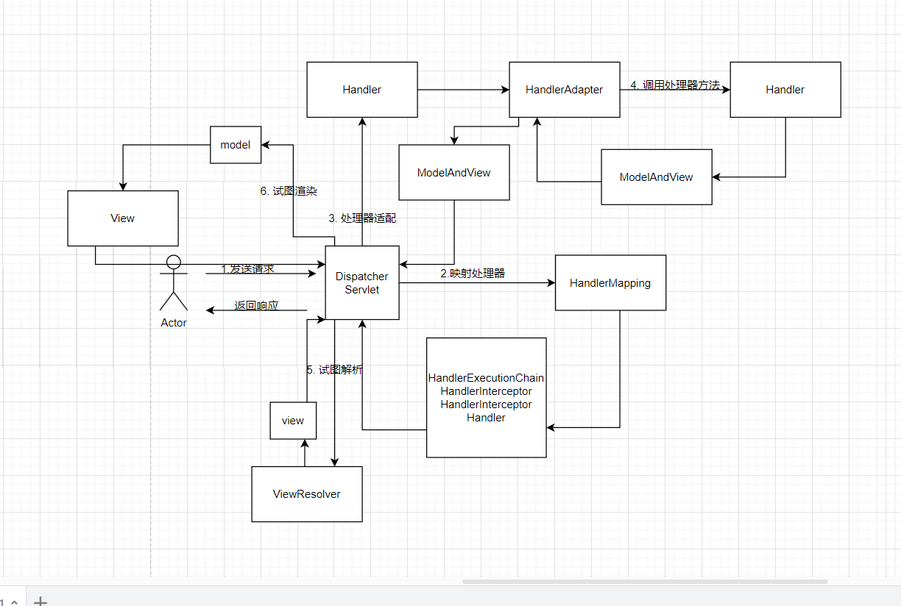

# Spring 基础

## 概念

- Bean： 由 Spring 管理的组件，组件目的在于实现某些功能。是对象的子范围。
- Spring 框架管理这些 Bean 的创建工作，即由用户管理 Bean 转变为框架管理 Bean，这个就叫控制反转 - Inversion of Control (IoC)，这是一个概念性的内容。
- 存放 Bean 的地方叫做 IoC Container
- 何种方式配置 Bean? xml 配置、 Java 配置、 注解配置
- Bean 有自己的生命周期，方便管理；
- 应用程序代码从 Ioc Container 中获取依赖的 Bean，注入到应用程序中，这个过程叫 依赖注入。
  > 所以控制反转是通过依赖注入的过程实现。
- 依赖注入的方式：1. 构造函数注入 2. Setter 方法注入 3.字段注入 4.接口注入

## IOC 控制反转

控制反转，一种思想。控制 Bean 的权利反转到了 IOC 容器中。还是很好理解的，不要想复杂就是字面意思。通过该思想，对象之间耦合度更松，提高了灵活性。

- IOC 配置的三种方式
  1.  xml 配置方式：结构清晰，但是配置繁琐
  2.  Java 配置：将类的创建交给我们配置的 JavcConfig 类来完成，Spring 只负责维护和管理；配置方便，但是不好理解，过多的 Java 方式的配置显得可读性差；
  3.  注解配置：类上声明注解，让 spring 来管理，Spring 会自动扫描带有@Component，@Controller，@Service，@Repository 这四个注解的类，然后帮我们创建并管理，前提是需要先配置 Spring 的注解扫描器;便捷，快速；

## DI 依赖注入

字面意思，将依赖注入到被依赖的组件中。
容器动态的将某个依赖关系注入到组件之中，在依赖注入（Dependency Injection，DI）中，动态注入指的是在运行时（即程序运行期间），IoC（控制反转）容器根据配置或者其他规则，动态地将依赖关系注入到组件中。

- 谁注入谁？
  注入者：IOC 容器；
  被注入者：需要依赖的组件，即 UserService 中依赖于 UserRepository 对象进行数据库访问，那么 UserService 便是被注入者。

这里可以看出 DI 和 IOC 是一体两面的关系。

- 依赖注入的方式

  1.  构造方法注入（Construct 注入）： 在 XML 配置方式中，\<constructor-arg>是通过构造函数参数注入
      本质上是通过有参构造器，构造对象。
  2.  setter 注入，xml 配置中的 property 都是 setter 方式注入;
      本质上是通过空构造器构建对象后，通过 setter 方法写入对象
  3.  注解注入：
      以@Autowired（自动注入）注解注入为例，修饰符有三个属性：Constructor，byType，byName。默认按照 byType 注入。

      ```java
      @Target(ElementType.CONSTRUCTOR) #构造函数
      @Target(ElementType.METHOD) #方法
      @Target(ElementType.PARAMETER) #方法参数
      @Target(ElementType.FIELD) #字段、枚举的常量
      @Target(ElementType.ANNOTATION_TYPE) #注解
      ```

  - 通过 Constructor 构造：对构造器方法参数数量和类型一致的 bean 进行注入，
  - byName: 被注入的 Bean 名称必须于 set 方法后拼接的属性名一致，且 ID 名称的第一字母小写。

  ```java
   @Autowired
        @Qualifier("exampleDependency") // 使用@Qualifier指定Bean名称
       public void setExampleDependency(ExampleDependency exampleDependency) {
          this.exampleDependency = exampleDependency;
       }
  ```

  - ByType: 查找所有的 set 方法，将符合符合参数类型的 bean 注入。

- 以@Resource 方式注入,类似于 Autowired 的 ByName

  ````java
         @Target({TYPE, FIELD, METHOD})
         @Retention(RUNTIME)
         public @interface Resource {
         String name() default "";
         // 其他省略
         }
         //注入范围
         @Target(ElementType.TYPE) #接口、类、枚举、注解
         @Target(ElementType.FIELD) #字段、枚举的常量
         @Target(ElementType.METHOD) #方法
         ```


  ````

- @Inject 方式注入:@Inject 是根据类型进行自动装配的，如果需要按名称进行装配，则需要配合@Named；
  ```java
     @Target(ElementType.CONSTRUCTOR) #构造函数
     @Target(ElementType.METHOD) #方法
     @Target(ElementType.FIELD) #字段、枚举的常量
  ```

## AOP 切面编程

面向切面编程，一种设计思想。通过预编译方式和运行期间动态代理实现程序的统一维护的一种技术。

AOP 的作用是将业务代码中重复的部分抽取出来，单独做成模块并在合适的地方进行切入。

- AOP 中的概念：

  - 连接点：在应用程序执行过程中，特定的点，在 AOP 中表示为在哪里干；
  - 切入点：连接点的集合，在 AOP 中表示为在哪里干的集合；
  - 通知： 是在连接点上执行的具体操作，在切入点中的连接点上进行的一些行为。由前置，后置，环绕通知，在 AOP 中表示为干什么
  - 切面：提取出来的模块化组件
  - 引入：为已有的类添加额外新的字段或方法
  - 目标对象：该对象是切入点选择的对象，需要被通知的对象

- Spring AOP 的实现方式是动态织入，在运行时将增强的代码织入，这样往往是通过动态代理技术完成的；如 Java JDK 的动态代理(Proxy，底层通过反射实现)或者 CGLIB 的动态代理(底层通过继承实现)，

> 参考：
> https://pdai.tech/md/spring/spring-x-framework-aop.html#%E5%A4%9A%E7%A7%8D%E5%A2%9E%E5%BC%BA%E9%80%9A%E7%9F%A5%E7%9A%84%E9%A1%BA%E5%BA%8F

## SpringMVC

MVC 是一种软件架构模式，它将一个应用程序分为三个主要的组件：Model（模型）、View（视图）、Controller（控制器）.分别对应数据处理，数据展示，处理用户交互三种不同的业务逻辑，

### MVC 的请求流程



## IOC

## SpringBoot

基于约定优于配置的思想,提高了开发的效率，一定程度上缩短了项目周期

- 核心特点

  - 起步依赖，POM，maven 项目对象模型，定义了对其他库的传递依赖，这些东西加在一起即支持某项功能。
  - 自动配置：在程序运行的过程中，决定配置哪些参数。

- 填写 GAV 三元组
  Group: 是公司或者组织的名称，是一种命名空间的概念，比如网站，那么 group 可以是 com.enki
  Artifat: 当前项目的唯一标识,hellowold-dmeo-01
  Version: 项目的版本号，一般 xx-SNAPSHOT 表示非稳定版

- springboot 的 start 模块
  每个 Start 模块都包含了一组相关的依赖项，使得开发者可以更轻松地引入和管理特定功能或技术所需的库。 开发者只需引入所需功能的 Start 模块，而不必手动配置大量的依赖项，从而加快了项目的开发速度和便捷性。

- 什么是 JDBC（JavaDataBase Connectivity）
  Java 数据库连接，说白了就是用 Java 语言来操作数据库
- 什么是 ORM
  对象关系映射（Object Relational Mapping，简称 ORM）,ORM 是通过使用描述对象和数据库之间映射的元数据，将 java 程序中的对象自动持久化到关系数据库中
  映射关系：
  数据库的表（table） --> 类（class）
  记录（record，行数据）--> 对象（object）
  字段（field）--> 对象的属性（attribute）
