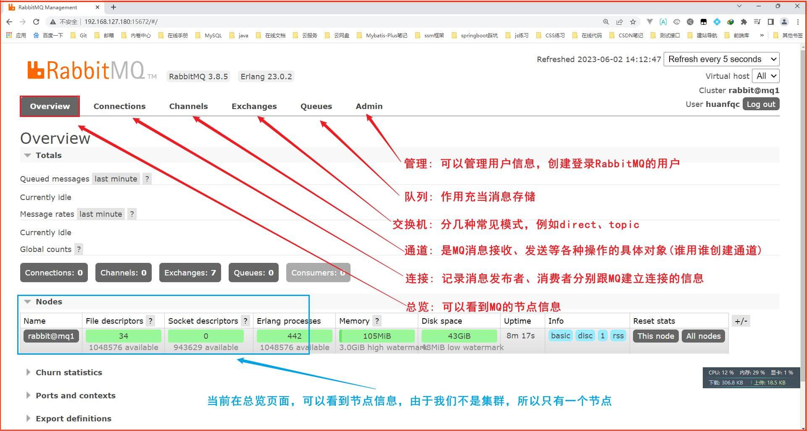
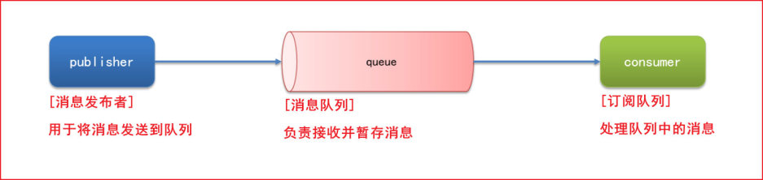
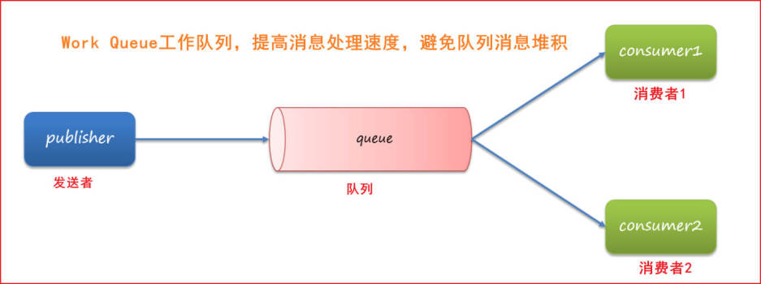
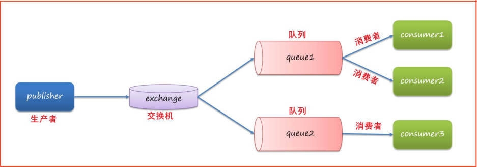

## 注册中心

- 概念
  注册谁："注册"通常是指微服务向服务注册中心注册自己的信息，注册微服务。用于其他微服务的管理和调用

1. 提供者和消费者
   服务提供者: 一次业务中，被其它微服务调用的服务。简单来说，服务提供者就是提供接口给其它微服务
   服务消费者: 一次业务中，调用其它微服务的服务。简单来说，服务消费者就是调用其它微服务提供的接口
2. Eureka 的原理
   原理主要包括服务注册、服务发现以及服务心跳等关键概念.

   - 服务注册：
     微服务在启动时会向 Eureka 服务注册中心注册自己的信息，包括服务名称、网络地址、端口号等。
     服务注册中心维护一个服务注册表，记录了当前系统中所有已注册的微服务信息。
     注册信息会包含一些元数据，例如健康状态、版本号等。
   - 服务续约（心跳）：
     注册成功后，微服务会周期性地向 Eureka 服务注册中心发送心跳请求，告知注册中心该服务仍然处于健康状态。
     如果某个服务在一定时间内没有发送心跳，Eureka 会将其从注册表中移除，认为该服务不再可用。
   - 服务发现：
     微服务在需要调用其他服务时，会向 Eureka 服务注册中心查询所需服务的信息。
     Eureka 服务注册中心返回一个服务列表，包含所有可用实例的网络地址和端口号。
     服务消费者可以根据这些信息构建调用地址，并发起请求。
   - 客户端负载均衡：
     Eureka 客户端（服务消费者）通常会在本地缓存一份从注册中心获取到的服务列表。
     客户端使用负载均衡算法从本地缓存中选择一个服务实例来发起请求，实现了基本的负载均衡。
     Eureka 客户端还支持 Ribbon 等负载均衡器的集成，使得负载均衡更加灵活。
   - 服务同步：
     Eureka 服务注册中心使用异步的方式在注册表中处理服务的注册和下线。
     当有服务实例注册或注销时，Eureka 会通过消息通知其他 Eureka 服务实例，保持服务注册表的同步性。

Eureka 通过 pom 坐标引入并在 yml 文件中配置发现 3. 服务发现

## Nacos

- 注册发现
  通过配置 properties 进行
- namespace 环境隔离
  命名空间:namespace:通过使用不同的 Namespace，你可以在同一套 Nacos 集群中创建多个独立的配置、服务等信息，实现不同环境（如开发、测试、生产）之间的隔离。
  > 每个 namespace 命名空间都有一个唯一 id。不同 namespace 命名空间下的服务不可见

springboot 配置文件加载顺序

- 读取 nacos 配置文件
  我们如果想要某些属性被所有环境都读取，那么就要写在 '服务名.yaml' 配置文件里面
  配置文件优先级
  服务名-profile.yaml > 服务名.yaml > 本地配置
- 配置 nacos 热更新
  注解更新

## Feign 客户端

远程调用
是帮助我们优雅的实现 http 请求的发送，解决 RestTemplate 复杂 URL 的问题

- Feign 的性能优化
  默认使用的是 URLConnection 这种客户端，URLConnection 是 jdk 自带的，用连接池代替默认的 URLConnection

## Gateway 网关

前面学的 Nacos 是对内负载均衡，现在学的 Gateway 网关是对外负载均衡和校验

1. 网关的作用
   网关功能:
   1、身份认证和权限校验
   2、服务路由、负载均衡
   3、请求限流

2.Spring Cloud Gateway 的路由配置非常灵活，可以根据具体的需求进行定制。以下是一些常见的网关路由配置项：
id: 路由的唯一标识符。
uri: 目标服务的 URI。可以是 HTTP 地址，也可以是 lb://service-id 的形式，其中 service-id 是注册在服务注册中心的服务名。
predicates: 断言，用于匹配请求的条件。比如 Path=/example/**表示请求路径匹配/example/**的将会被这个路由匹配。
filters: 过滤器，用于对请求和响应进行处理。可以用于添加请求头、修改请求和响应等。
order: 路由的顺序，越小越优先。

- 路由断言工厂

- 过滤器
  如果 order 值越小，那么优先级越高
  不同过滤器中，如果 order 值相同，那么优先级为 'defaultFilter 过滤器' > '路由过滤器' > 'GlobalFilter 过滤器'
- 网关的 cors 跨域配置

## Docker

为什么需要在 docker 里面使用数据卷呢，其实是为了解决容器与数据耦合的问题,主要目的是实现数据的持久化和共享

- docker 数据卷
  目的是持久化 docke 容器数据
  创建容器并挂在数据卷到容器内部指定的目录中，
  在挂载点进行修改文件

## MQ

- 消息模型

1. Hello World 队列模型案例
   

2. SpringAMQP 消息中间件
   简化 MQ 书写，SpringAMQP 是基于 AMQP 协议定义的一套 API 规范，提供了模板来发送和接收消息。简单说就是一个中间件，提供了模板方便我们操作各种消息模型
3. WorkQueue 模型的消息发接
   
   主要用于实现任务分发和异步处理的场景，比 helloword 模型多了消息确认和分发

4. Fanout 交换机
   

   消息订阅模式，允许将同一个消息发送给多个消费者
   交换机可以把同一个消息只发给其中一个队列，也可以把同一个消息发送给多个队列，是由交换机的类型来决定，不同的交换机类型，消息转发规则不同，相同点是都是负责转发消息的。交换机如果路由失败的话，消息就会丢失，因为交换机不负责存储消息。
   常见类型：
   1、Fanout: 广播
   2、Direct: 路由
   3、Topic: 话题
