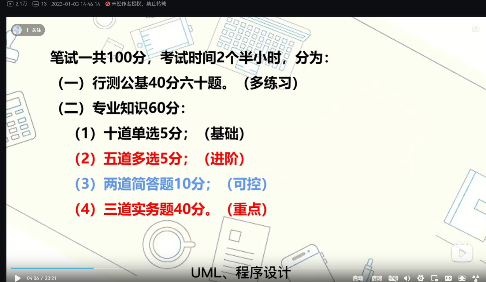
实务题相关内容

1. 和数据库相关 ER 图关系模型 sql 语句

2. 软件工程相关 UML 程序设计 测试用例 算法伪代码

3. 计算机网络 网络拓扑图 网络设备 组网 应用

真题试卷

题型
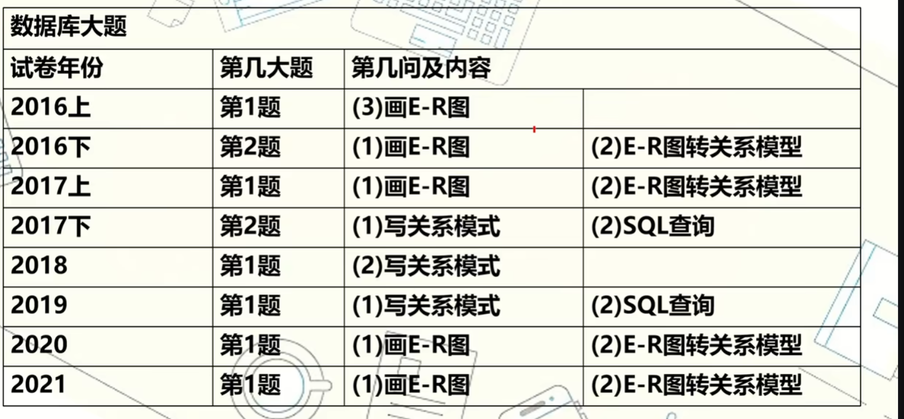
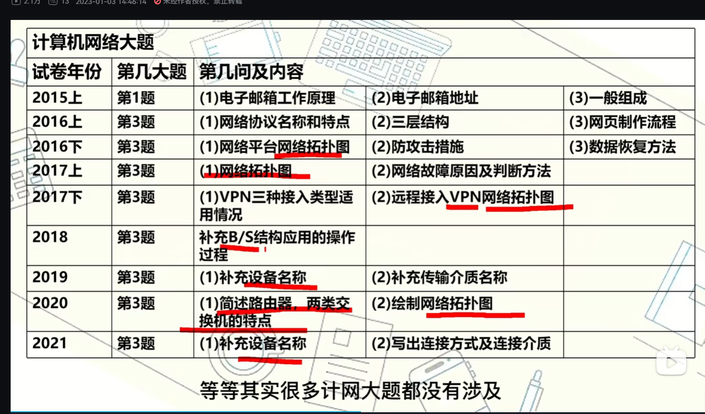
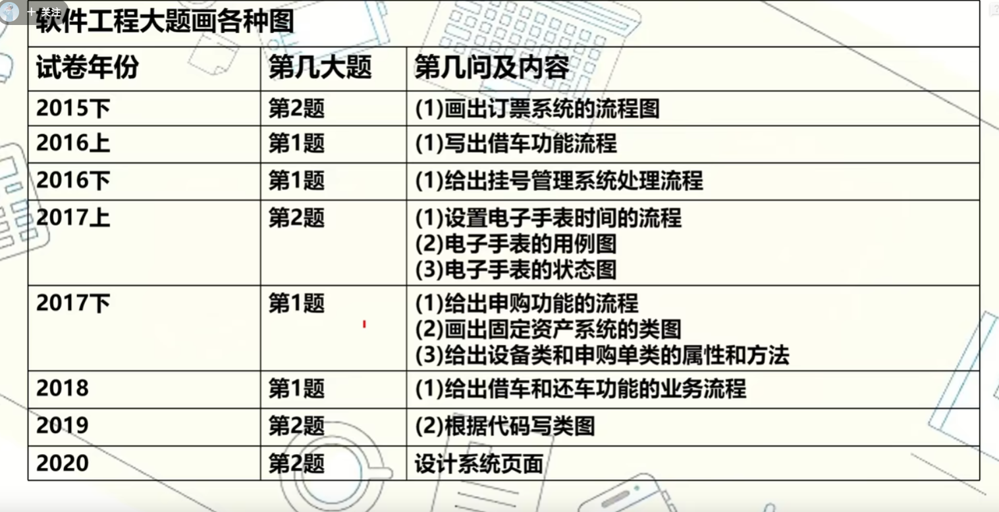
选择题
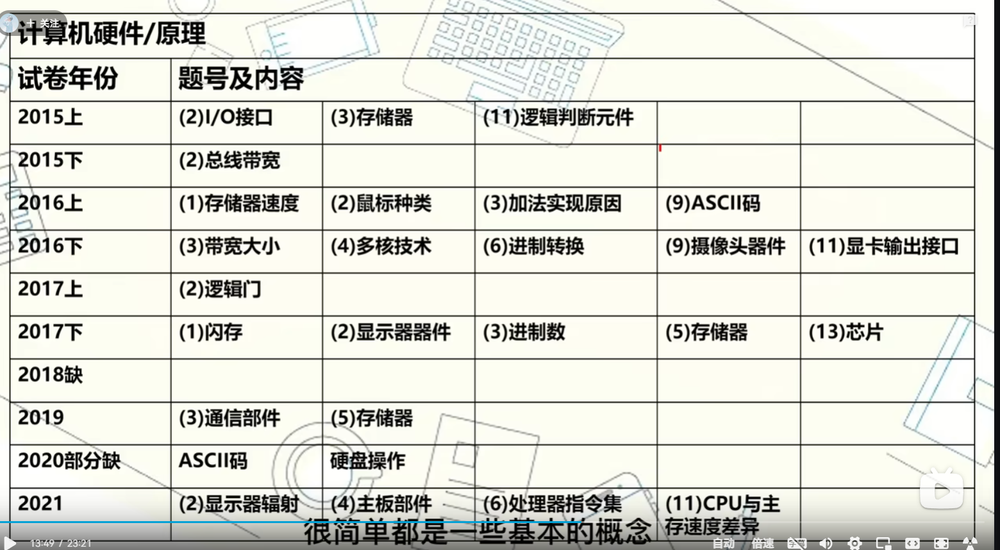
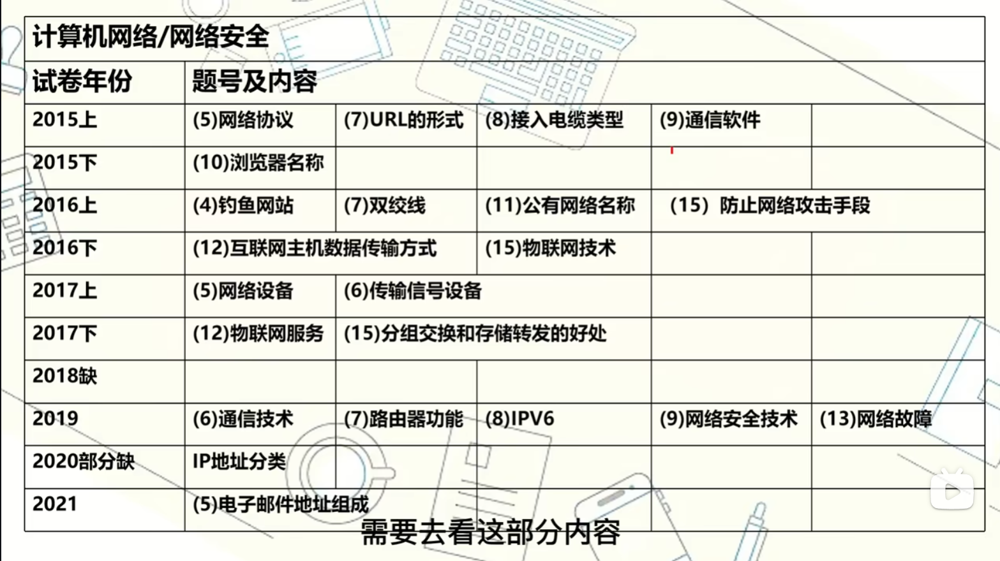
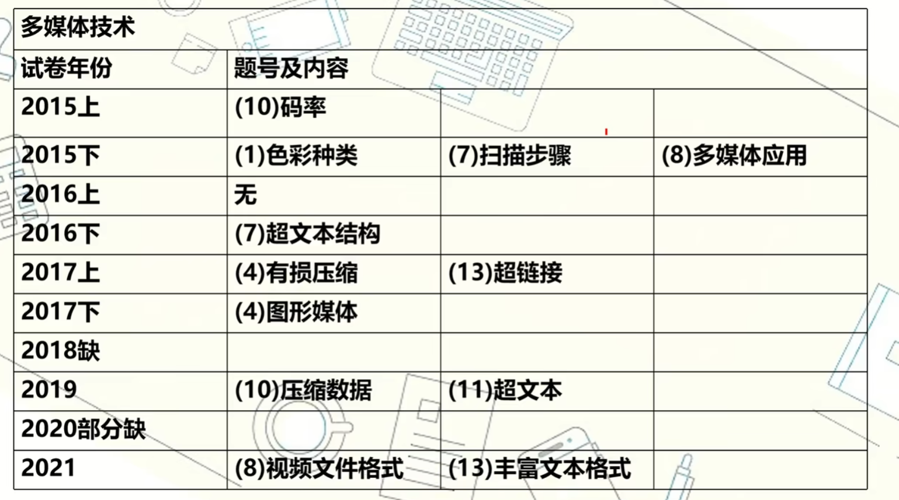
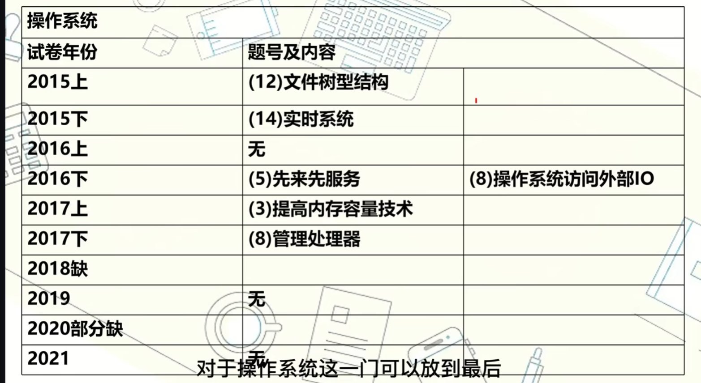
存储
考试内容
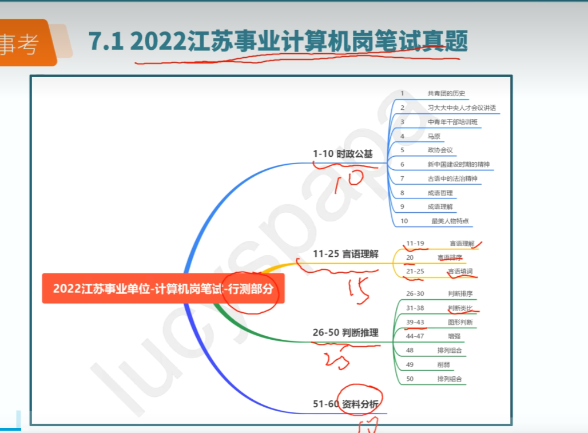
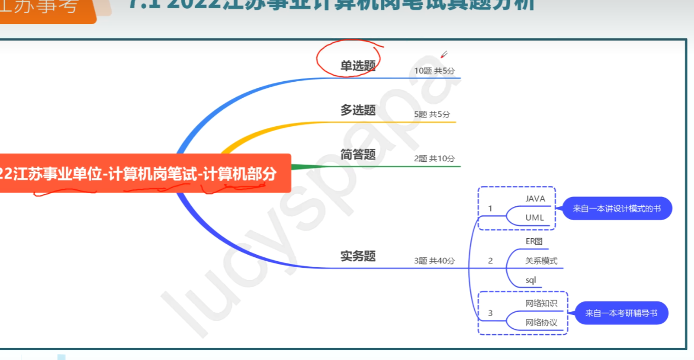

---

# 软件工程

1.可行性研究阶段；2、需求分析阶段；3、设计阶段；4、实现阶段；5、测试阶段；6、维护阶段

## 软件生存周期

- 瀑布模型：
  瀑布模型是将软件生存周期各个活动规定为依现行顺序连接的若干阶段的模型。它包括可行性分析、项目开发计划、需求分析、概要设计、详细设计、编码、测试和维护。它规定了由前至后、相互衔接的固定次序，如同瀑布流水，逐级下落。
- 快速原型模型：快速建立起来的可以在计算机上运行的程序，能完成的功能往往是最终长怕的一个子集，优点：有助于满足用户真实需求，减少开发错误和成本
- 螺旋模型：使用快速原型及其他方法尽量降低风险。每个螺旋周期分为：指定计划 风险分析实施工程 用户评估
- 喷泉模型：面向用户需求为开发动力，适合于面向对象的开发方法

## 软件测试

系统测试的策略
系统测试是软件开发生命周期中的一个重要阶段，用于验证整个系统是否符合预期的功能和性能要求。在进行系统测试时，可以采用多种测试策略来确保对系统进行全面、有效的测试。以下是一些常见的系统测试策略：

功能测试（Functional Testing）：验证系统的功能是否按照需求规格说明书中定义的功能要求进行工作。这包括单元测试、集成测试、系统测试等阶段，以确保软件的每个功能都能够正常工作。

性能测试（Performance Testing）：评估系统在不同负载条件下的性能表现，包括响应时间、吞吐量、资源利用率等。常见的性能测试包括负载测试、压力测试、容量测试等。

可靠性测试（Reliability Testing）：验证系统的稳定性和可靠性，包括系统的故障恢复能力、容错性等。这可以通过故障注入、恢复测试等技术来实现。

兼容性测试（Compatibility Testing）：确保系统在不同的操作系统、浏览器、设备和网络环境下能够正常工作。这包括跨平台测试、跨浏览器测试、跨设备测试等。

安全测试（Security Testing）：评估系统的安全性，包括身份验证、授权、数据加密、防火墙和安全漏洞等方面的测试。

易用性测试（Usability Testing）：评估系统的用户界面设计和用户体验，确保系统易于使用、理解和学习。

可维护性测试（Maintainability Testing）：评估系统的代码结构、文档、命名规范等方面，以确保系统易于维护和修改。

回归测试（Regression Testing）：在对系统进行更改或修复后，重新运行之前的测试用例，以确保新的更改不会导致现有功能的退化或引入新的问题。

## 伪代码

正文用基本控制语句进行分割 加工中的操作用自然语言短语进行控制
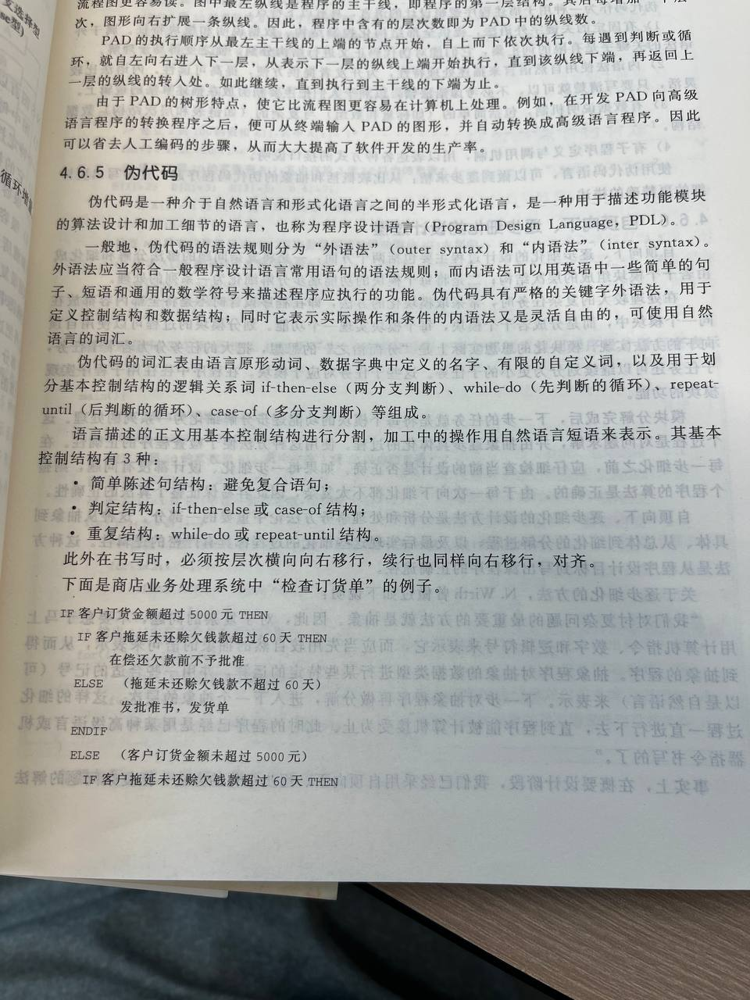

面向对象分析模型的三种构成 ：用例模型 对象模型（类图） 交互模型（状态图 顺序图）

## 软件测试

- 黑盒测试： 功能性测试 目的 发现是否由不正确的功能 正确接收输入输出 以及结果正确性能满足，等
  用例： 等价类划分 边界测试
- 白盒测试：一种结构性测试方法，测试人员需要了解软件的内部实现细节，包括代码逻辑、数据结构和算法等。据代码的逻辑结构和覆盖率等指标，设计测试用例来验证代码是否正确实现了预期的功能
  逻辑覆盖（语句 判定 条件 判定-条件 条件组合 路径）
  软件测试的策略是在软件开发生命周期中确定测试的方法和计划，以确保软件满足预期的质量标准。下面是一些常见的软件测试策略：
- 软件测试的策略
  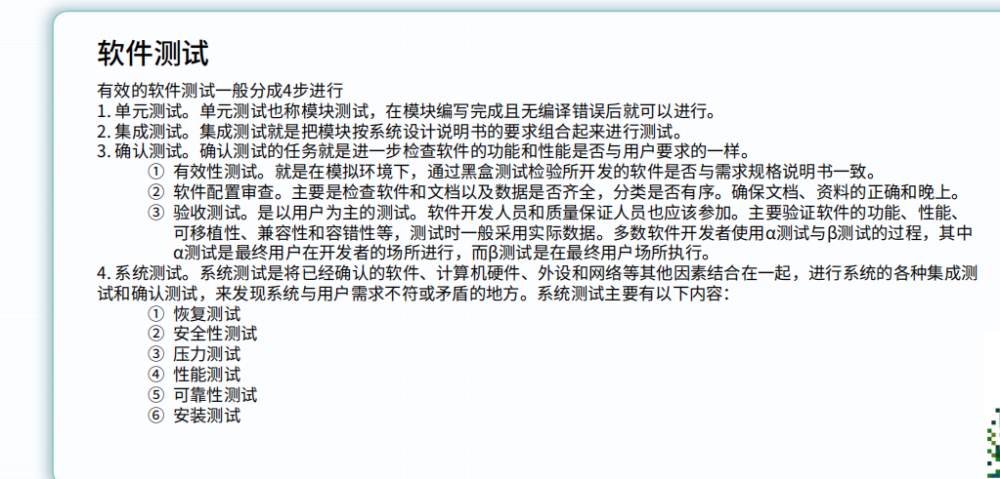

1. **验证与确认**：

   - 验证测试（Verification Testing）确保软件是否满足了开发规格说明书中的要求，即开发的是正确的产品。
   - 确认测试（Validation Testing）则确保软件是否满足了用户的实际需求，即开发了正确的产品。

2. **静态与动态**：

   - 静态测试（Static Testing）在软件代码或文档的早期阶段进行，包括代码审查、静态分析和需求分析等。
   - 动态测试（Dynamic Testing）在软件运行时进行，包括功能测试、性能测试和安全测试等。

3. **自动化与手动**：

   - 自动化测试（Automated Testing）利用测试工具和脚本来执行测试，提高测试效率和覆盖率，适用于重复性高的测试任务。
   - 手动测试（Manual Testing）由测试人员手动执行测试用例，通常用于探索性测试和用户体验测试等需要人工判断的场景。

4. **逐步增量**：

   - 逐步增量测试（Incremental Testing）将软件系统分解为较小的模块或单元，逐步测试和集成这些模块，逐渐增加测试的复杂度和覆盖范围。

5. **回归测试**：

   - 回归测试（Regression Testing）确保在对软件进行修改或更新后，之前的功能仍然能够正常工作，防止新的改动影响到原有功能的稳定性。

6. **风险驱动**：

   - 风险驱动测试（Risk-Based Testing）根据软件功能、复杂性和重要性等因素，确定测试的重点和优先级，优先测试高风险的部分。

7. **用户参与**：

   - 用户参与测试（User Acceptance Testing，UAT）由最终用户或客户参与，验证软件是否符合实际使用需求和期望。

8. **持续集成**：
   - 持续集成测试（Continuous Integration Testing）将软件的集成和测试与开发过程相结合，通过自动化构建和测试来保证软件质量。

综上所述，软件测试策略需要根据项目的特点、需求和约束条件来制定，结合不同的测试方法和技术，以确保软件具有高质量、高可靠性和高用户满意度。

# 计算机网络

### 传输中介

双绞线 减少相邻导线之间的电磁干扰 抗电磁干扰，灵活性强 成本低 易于维护适用于短距离通信 缺点:信号衰减安全性低
同轴电缆
光纤 ：传输损耗小 抗雷电和电磁干扰性能好 无串音干扰 保密性好 体积小重量轻，使用安全
演化过程 粗同轴电缆 细同轴电缆 双绞线 光纤

## 不同网络的层的设备

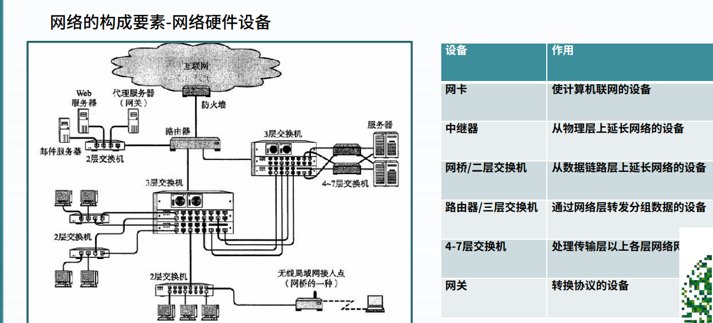

- 物理层 集线器 中继器
  - 中继器：将信号放大再转发出去，以消除信号在电缆中传输产生的失真和衰减，进而扩大网络传输的距离。主要是在物理层面上延长网络的设备。不负责判断数据错误，以及不能再不同速度媒介中传播。不能无限使用，串联的中继器不能超过 4 个，串联的 5 段介质中只有 3 段可以挂载计算机
  - 集线器一种多款口的中继器，用于连接多台计算机或其他网络设备，以形成局域网；只起到信号放大转发作用，不具备定向传送能力，信号方向固定，集线器站点用双绞线不超过 100 米 远距离可以用光纤。集线器直接于交换机相连，连接到桌面.
  - 集线器缺点：不能分割冲突域，太多机器同时通信必然冲突

以太网中的最短有效帧长为 64 字节，以太网站点不超过 200 米,以太网和站点用光纤连接
中继器是一种用于放大信号并将其重新发送的设备，用于扩展网络的范围。

- 链路层 交换机 网桥 网卡

  - 网桥 连接数据链路层不同的网络。根据 MAC 地址对数据帧进行转发和过滤，隔离各网段的冲突域，过滤通信量，增大吞吐量，扩大物理范围提高可靠性。但存储转发增加了时延，没有流量控制功能，用户太多以太网中会产生广播风暴，即过多的广播信息发生网络拥塞。
  - 网桥分类：源路由网桥，在源路由网桥中，数据帧中包含了源和目标主机之间的完整路由信息，可以利用最佳路由，充分利用网络资源
    透明网桥：只能使用生成树，也不能进行负载均衡 但即插即用 很方便
  - 以太网交 域网交换机
    将网络分割成不同的冲突域，提供更高的带宽，减少了管理成本，开销。能够同时连接很多端口并进行无碰撞的传输，并且能够做到独占传输媒介的带宽 不能防止广播风暴
    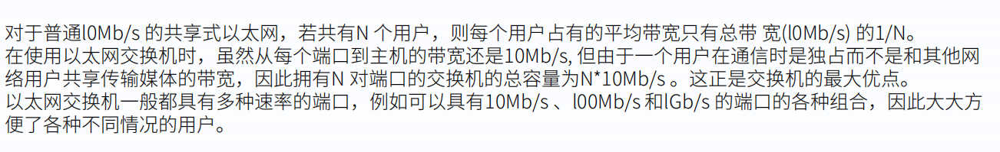
    交换模式：直通式交换机（直通模式中可以使用存储转发 但存储转发不能用直通）和存储转发式交换机
    ，
  - 网络层 路由器 三层交换机
    - 三层交换机 三层交换机是一种网络设备，结合了交换机和路由器的功能。
      目的在于加快大型局域网内部的数据交换，一次路由，多次转发。同时可以减小广播风暴的危害，将大型局域网分割为小的局域网，只是用路由器进行转发会因为端口限制和转发速度问题，限制网络规模和速度，所以使用三层交换机。一般三层交换机在网络的核心层，局域网之间的互联使用三层交换机，和网络的连接使用路由器
      路由器是用于连接不同网络并在它们之间转发数据包的设备。
    - 路由器 网络层中对不同网络进行连接和分组报文进行转发的设备，隔离了广播域，主要功能分组转发和路由选择
    - 网关：实现两个不同网络之间的通信
      应用层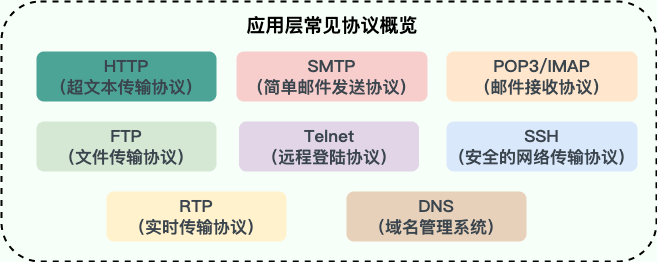
      传输层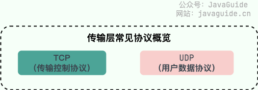
      网络层 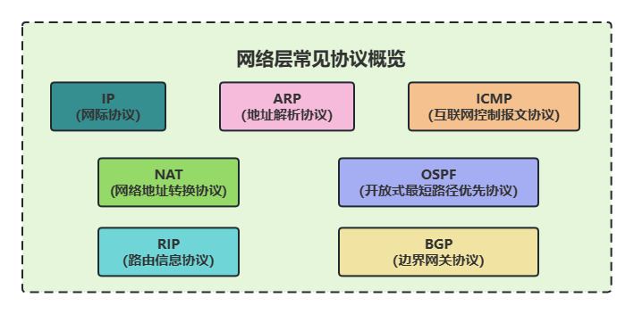

> 交换机和路由器的区别
> 传统交换机工作在数据链路层，用于在局域网中对 MAC 地址进行确定目的地址 并转发数据，且不能做到负载均衡和最有转发，同时限制于端口数量，交换机不能做到对广播风暴的避免但能够完成对局域网的分割。一般有直通转发和存储转发两种方式，
> 路由器 工作在网络层，通过对分组报文 IP 的转发，能够做到对数据的最佳转发路径并，做到一次路由多次转发的特点，用于连接不同逻辑的网络，能够隔绝网络风暴隔离网络。并且路由器提供防火墙功能，能够提高数据转发的可靠性

> 集线器：工作在物理层 集线器用于在局域网中对设备的连接，其数据传输共享带宽，只能半双工的工作，但交换机能够独占带宽

> 网桥，连接两个逻辑相同的网络的设备，一般有两个接口，基于 MAC 地址转发，

- 防火墙
  是一种网络安全设备或软件，用于监控和控制网络流量，以保护网络免受未经授权的访问、恶意软件和其他网络威胁的侵害。防火墙通过检查进出网络的数据包，并根据预定义的安全规则来允许或阻止数据包的传输。防火墙通常位于网络的边缘，作为网络与外部世界之间的关键防线

- 不同层数据名称
  应用层 报文
  运输层 报文段 tcp 用户数据报 udp
  网络层 数据报
  数据链路层 帧
  物理层 比特流
  数据+传输层首部=报文；报文+网络层首部=IP 分组；IP 分组+数据链路层首部与尾部=数据帧；数据帧到了物理层变成比特流
- 三层网络架构 接入层 汇聚层 核心层

  - 接入层负责将电脑等设别接入到网络中，负责用户管理认证，地址识别 ，用户信息收集等功能。
  - 汇聚层提供基于策略的连接，普遍使用二层交换机
  - 核心层用传输大流量数据 包含路由器防火墙 核心交换机一般使用三层高性能交换机

- 网络拓扑图
  网络拓扑图的常见结构有星型结构、环形结构、总线结构、网状结构、树型结构、混合结构等。

- 物理层直接通信不涉及数据格式和可靠传输
  数据链路层 处理数据帧的点对点可靠传输
  网络层实现数据包的路由和转发，不可靠传输和无连接
  传输层涉及提供端到端的数据传输服务，确保数据的可靠传输
  会话层涉及到通信的终止维护和建立
  表示层涉及数据表示编码和加密
  应用层涉及到服务和应用之间通信
- ABCD 类地址
  A 1.0.0.1-126.255.255.254 网络号码 : 1-126
  B ：128.1.0.1-191.255.255.254 网络号：128.1 ~ 191.255
  C : 192.0.1.1-223.255.255.254 网络号： 192.0.1 ~ 223.255.255
  D： 224.0.0.1-239.255.255.254 网络号：224~239
  **从浏览器地址栏输入 url 到显示主页的过程？**

- DNS 协议解析 将域名解析成对应的 IP 地址。
  - DNS 解析：
    若本地服务器中有对应的 IP 地址缓存则直接返回，否则本地 DNS 服务器将向根域名服务器发送请求，找到顶级域名服务器在通过顶级域名服务器找到权限域名服务器得到最终的 Ip 地址
- TCP 连接：与服务器通过三次握手，建立 TCP 连接
- 向服务器发送 HTTP 请求
- 服务器处理请求，返回 HTTP 响应
- 浏览器解析并渲染页面
- 断开连接：TCP 四次挥手，连接结束

### TCP 握手

**三次握手**
简述三次握手
第一次握手：客户端发送带有 SYN 同步标志位置 1 的报文段并将序列号保存为客户端的随机初始序列号 x 发送给服务器。
第二次握手：服务器接收到客户端的数据后回复客户端 回复 SYN 和 ACK 标志置为 1 的报文段其中序列号为服务器随机初始化序列号 y，同时将确认应答号保存为客户端序列号 x+1；
第三次握手：客户端收到服务器数据后回复服务器，回复 ACK 标志置为 1 的报文段，其中的确认应答号字段保存为接收到的服务器序列号 y+1
确认序列号=原始序列号+TCP 段的长度

**四次挥手**
第一次挥手：客户端关闭向服务器的连接，向服务器发送 Fin 标志位置 1 的报文段

第二次挥手:服务器收到关闭连接请求后向客户端返回一个 ACK 报文段
客户端接收到后，表示客户端的连接关闭
第三次挥手，服务器向客户端发送 fin 标志位置为 1 的报文段
第四次挥手 客户端收到数据后，向服务器发送 ACK 报文段表示连接关闭

> 客户端最后一次 ACK 包进入到 Time_wait 状态，不是直接进入 CLOSED 状态关闭连接
> 目的是确保不在有数据包出现在网络中
> 当客户端向服务器发送最后一个 ACK 报文时 ，可能出现连接堵塞，导致服务器接受不到报文需要服务器向客户端请求重传，而其中的 Time_wait 时长表示保存再客户端到服务器所存活的最长时间 2MSL

### 建立连接后数据传输的变化

客户端的序列号为 100 发送数据大小 200 服务端响应的序列号为 100+200+1

### 广播

单播 电话
广播 电视 将消息丛从 1 台主机发送给与之相连的所有其他主机。
多播 电视会议 不同之处在于多播要限定,某一组主机作为接收端

#### 对称加密和非对称加密

加密和解密是一种数学互逆操作，其中互逆需要用秘钥完成，而**对称加密**中使用的加密和解密秘钥相同，类似于解压缩加密压缩文件所需要提供的密码。对称加密速度快

**非对称加密**即“加密”和“解密”使用【不同的】密钥 一般公钥（公开分享）经服务器发送给客户端 让客户端将信息通过公钥进行加密后传输，而服务器将接受到的加密信息通过私钥进行解密，保证只有服务器可以知道信息内容。在 HTTPS 中，TLS/SSL 协议下使用的非对称加密算法主要是 RSA 算法

> 常见的非对称加密算法有 RSA、DSA 和 ECC 等。其中，RSA 是最流行的一种非对称加密算法。它的安全性基于质因数分解问题，即将一个大的合数分解为两个质数的乘积的难度。DSA 是数字签名算法，用于数字签名和验证，其安全性基于离散对数问题。ECC 则是基于椭圆曲线的加密算法，其安全性也基于离散对数问题。
> 常见的对称加密算法主要有 DES 、 3DES 、 AES 等
> 不需要密钥的散列算法主要有 SHA-1 、 MD5 等

### 绘制 ER 图

实体 现实中存在的个体 用长方形表示
联系 实体之间的联系 用菱形表示
属性 用椭圆形表示

- 将 er 图转为关系图
  https://blog.csdn.net/HaoDaWang/article/details/78098937?locationNum=4&fps=1

1 对 1 关系 在两个实体任选一个添加另一个实体的主键作为外码即可。
1 对多关系 N 端添加另一端的主键作为外码 作为属性 并将联系的属性也作为属性添加
多对多 关系 先将之间的联系转为实体，在该实体上的主键为与之相关的另外两个实体的主键联合，并添加自己的属性.其他实体不需要添加多余信息

### 用例图

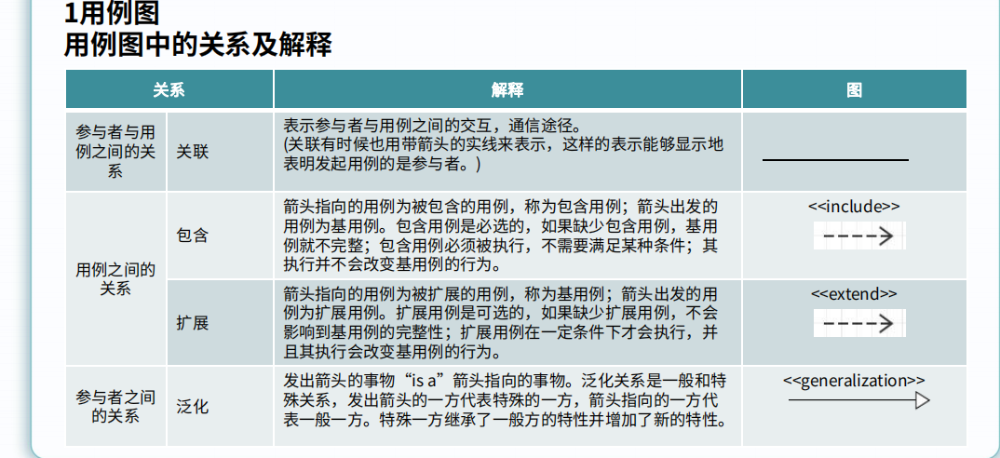
什么是用例：相当于系统中可以让用户使用的功能

### 状态图

### 网络拓扑图中的设备

- 常见的拓扑结构：总线型 单条传输线是单点故障，如果传输线出现故障则整个网络将不可用
  星型 中心节点是单点故障，如果中心节点故障则整个网络将不可用
  网状 成本高、布线复杂、管理和维护困难

路由器连接外网，并和交换机相连，交换机和设备相连

立方体的是交换机
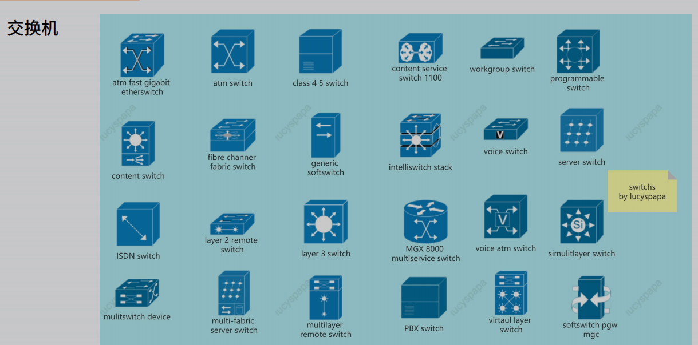
圆柱体是路由器
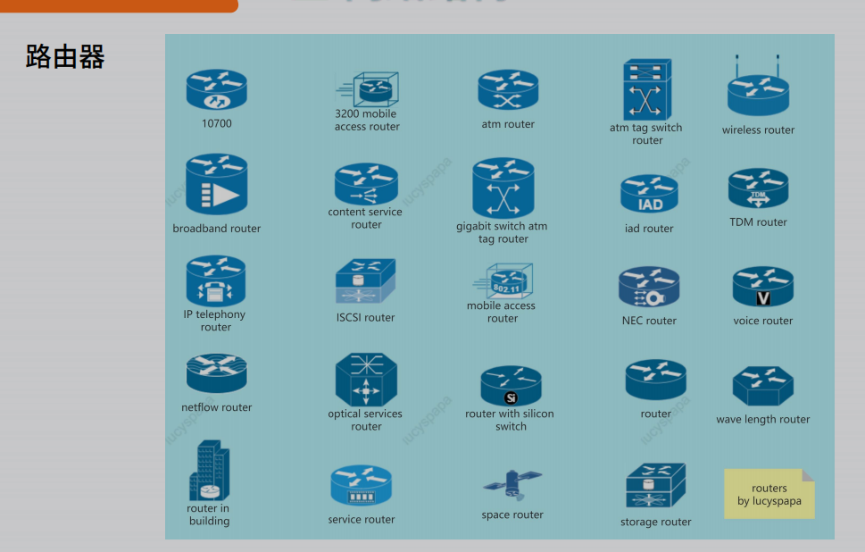
服务器
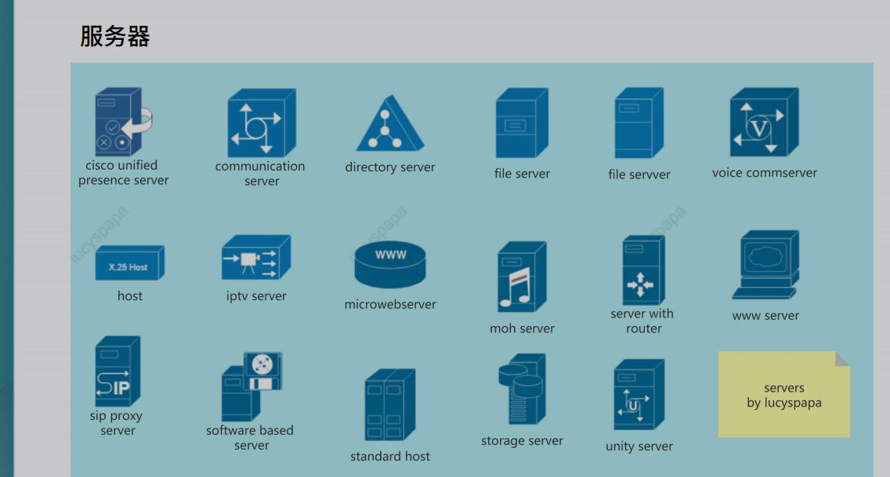
无线设备
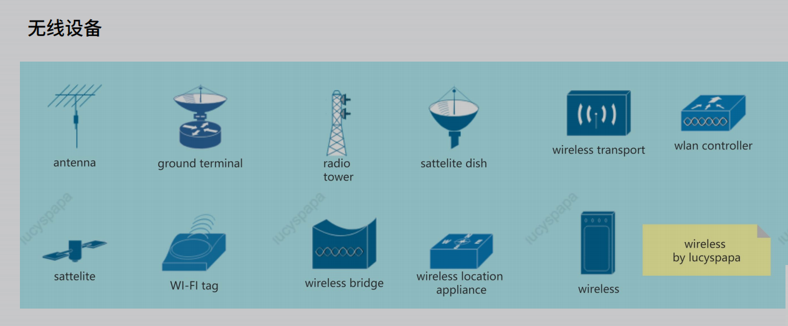
存储
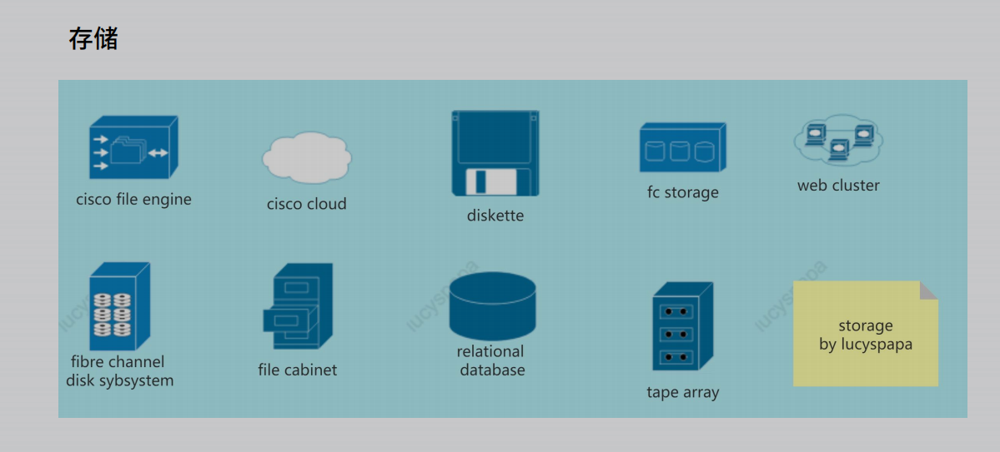
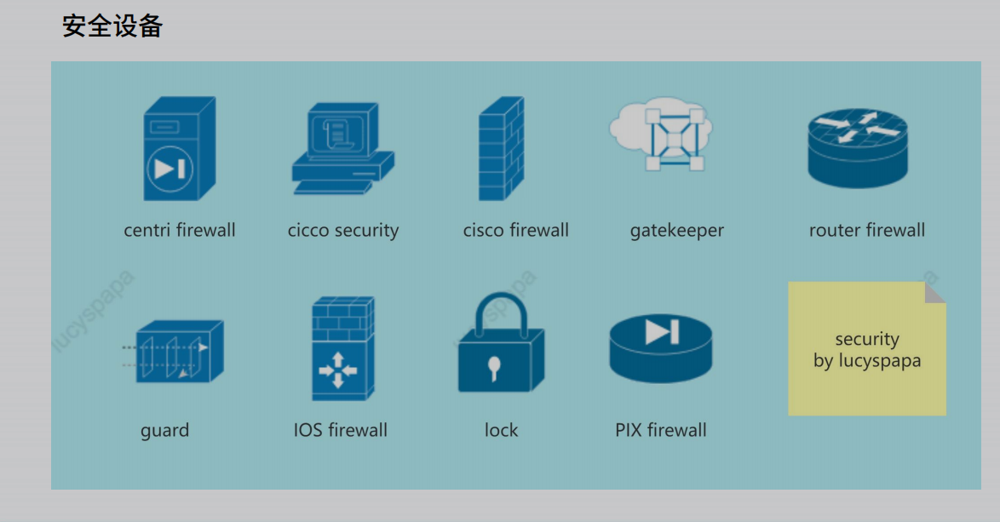
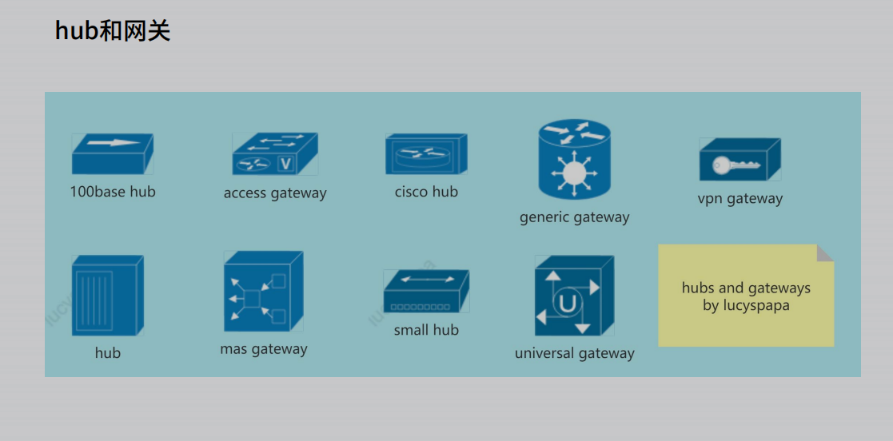

- 核心交换机
  核心层可以提供最优的区间传输， 汇聚层可以提供基于策略的连接 ，而接入层可以为多业务应用和其他的网络应用提供用户到网络的接入。

- 不同层交换机区别
  核心层交换机或是三层交换机的主要功能是用于路由选择及高速转发的，提供优化、可靠的骨干传输结构，因此核心层交换机应用有更高的可靠性和吞吐量。

  汇聚层交换机是多台接入层交换机的汇聚点，作用是将接入节点统一出口，同样也做转发及选路。它必须能够处理来自接入层设备的所有通信量，并提供到核心层的上行链路。接入层交换机的功能是将终端用户连接到网络，因此接入层交换机具有低成本和高端口密度特性。

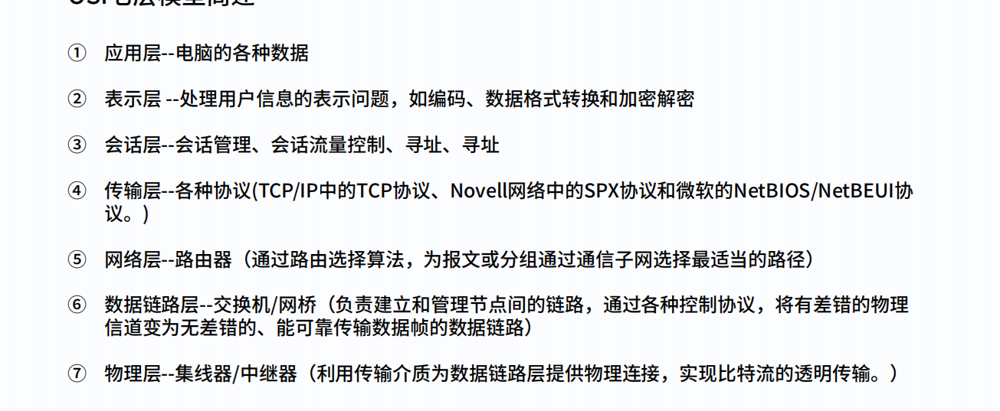
各层对应的协议
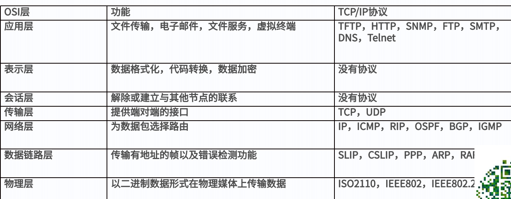

### 拓扑

在 n 个节点的星形拓扑结构中，有 n-1 条物理链路

### 类图的画法

泛化： 继承关系 带三角箭头的实线 箭头指向父类
实现：带三角箭头的虚线，箭头指向接口。
关联：带普通箭头的实心线，指向被拥有者 强关系 以属性的方式出现 关联关系当类实例化时候就产生
聚合：带空心菱形的实心线，菱形指向整体。表示整体由部分构成的语义；即使整体不存在 部分依旧存在
组合：带实心菱形的实心线，菱形指向整体。 一种强关联状态 整体不存在 部分便不存在
依赖：带箭头的虚线，指向被使用者。两个类非常弱的关系 表现为在方法中被引用 依赖关系当类的方法调用时而存在
依赖和实现是虚线，继承实现是三角,聚合空心 组合满
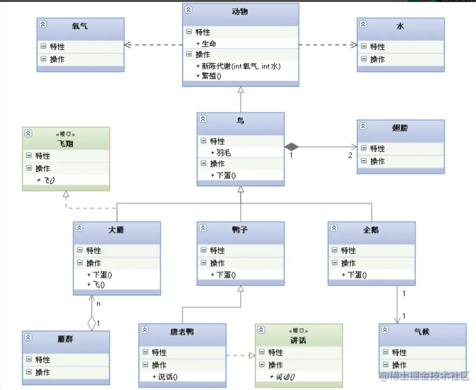

\+ ：表示 public

\- ：表示 private

\#：表示 protected（friendly 也归入这类）
属性的表示方式 可见性 名称：类型
方法表示：可见性 名称(参数列表)

## 软件设计原则

单一职责原则 一个类只有一个引起其变化的原因，一个类只有一个职责 最基本的原则
里氏替换原则：子类可以在父类出现的地方进行替换
开闭原则：对修改关闭 对拓展开放
依赖倒置原则：
接口隔离
迪米特原则：最少知识原则 强调类之间的松耦合
聚合复用原则：更多的使用组合 而不是继承

### 设计模式

工厂
单例
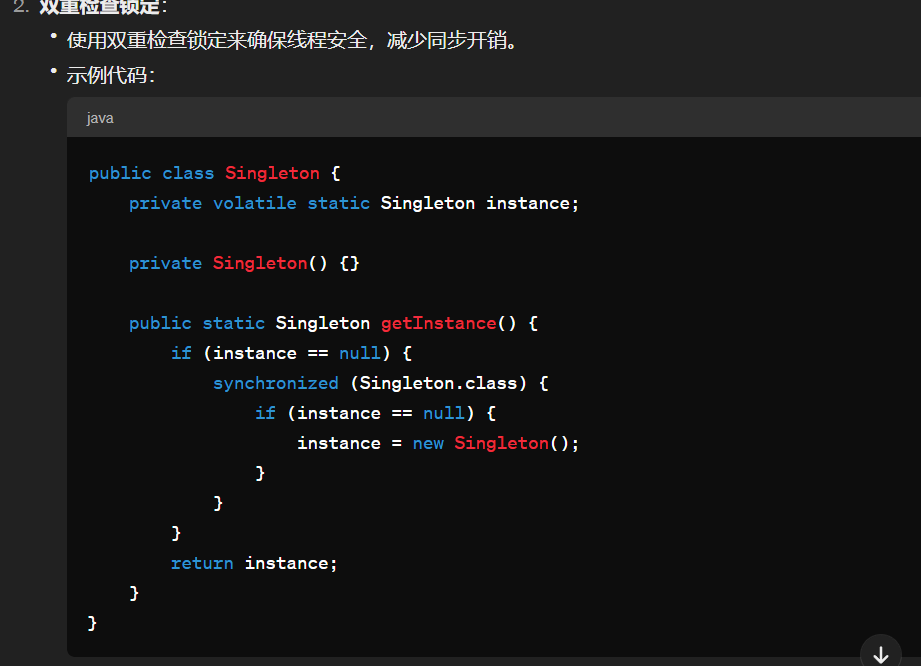

### 不同网络层的设备

### 路由器

在网络层中负责路由选择和分组转发

### 交换机和路由器的区别

1. 工作层次： 交换机在数据链路层 路由器在网络层
2. 转发对象： 交换机通过 mac 地址确定目的，路由器通过 IP 地址确定数据转发地址
3. 转发范围： 交换机在局域网中，用于局域网中的内部通信。路由器用于连接不同网络，进行对数据的分组和转发；
4. 交换机只能分割冲突域，不能分割广播域名，路由器可以分割广播域

### 路由器和各层交换机的作用

路由器： 提供对数据包的分组和转发功能，连接不同网络，并分割广播域防止广播风暴
，通过设置防火墙提供更安全的实施策略。
各层交换机：二层交换机：工作在局域网中的在数据链路层中根据 mac 地址对数据包进行转发，减少网络冲突提高性能。
三层交换机：等同于路由器和支持 VLAN 的二次交换机的集成体，同时进行 MAC 地址和 IP 地址的转发

### VPN

IP 专用地址

### 同步传输和异步传输

### 地址分类

### IPV6

长度 128

### 伪代码

不定义变量
输入 read a, b , c
输出 print x
赋值 <-
while
while(条件) do
{

}
end while

for 循环
for 变量 <- 1 to n
{

}
end for

数组 A[1...j]

执行过程 从 begin 开始 end 结束

### 范式

元组：表中的一行就是一个元组。
　　分量：元组的某个属性值。在一个关系数据库中，它是一个操作原子，即关系数据库在做任何操作的时候，属性是“不可分的”。否则就不是关系数据库了。
　　码：表中可以唯一确定一个元组的某个属性（或者属性组），如果这样的码有不止一个，那么大家都叫候选码，我们从候选码中挑一个出来做老大，它就叫主码。
　　全码：如果一个码包含了所有的属性，这个码就是全码。
　　主属性：一个属性只要在任何一个候选码中出现过，这个属性就是主属性。
　　非主属性：与上面相反，没有在任何候选码中出现过，这个属性就是非主属性。
　　外码：一个属性（或属性组），它不是码，但是它别的表的码，它就是外码。

- 第一范式 属性不可分 所有关系型数据库必须满足，所谓第一范式（1NF）是指数据库表的每一列(即每个属性)都是不可分割的基本数据项，同一列中不能有多个值，即实体中的某个属性不能有多个值或者不能有重复的属性。简而言之，第一范式就是无重复的列。
- 第二范式（2NF）：符合 1NF，并且，非主属性完全依赖于码。
- 第三范式 消除传递依赖
  什么是依赖 在属性 X 确定的情况下能够确定 Y 的属性称为 Y 依赖于 X
  X->Y

### 原码 补码 反码

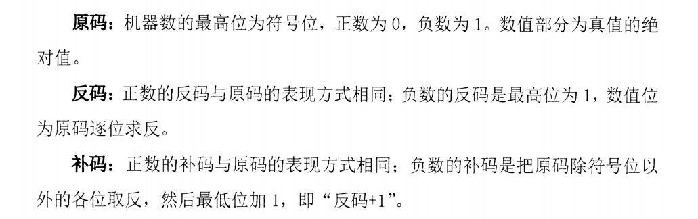
在计算机中，通常使用补码来表示带符号整数，因为补码具有简单的加法运算性质，并且只有一个表示 0 的方式。在进行补码的加减运算时，不需要额外的符号位判断，只需要进行普通的二进制加减运算即可。

### UML

用例图之间的关系
参与者
用例
之间的关系
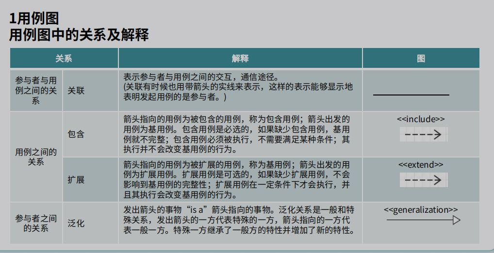

### 存储设备速度

寄存器>L1 高速缓存>L2 高速缓存>L3 高速缓存>主存>本地二级缓存（本地磁盘）>远程二级存储。

- 寄存器
  是中央处理器内的组成部分。寄存器是有限存贮容量的高速存贮部件，它们可用来暂存指令、数据和地址。
- 高速缓存
  高速缓冲存储器是存在于主存与 CPU 之间的一级存储器， 由静态存储芯片(SRAM)组成，容量比较小但速度比主存高得多， 接近于 CPU 的速度。
- 内存或是主存 RAM 断电数据消失 主要由 DRAM 组成 cache 由 SRAM 组成
  又叫主存储器，简称主存、内存。就是我们常说的内存条。用于保存进程运行时的程序和数据，处理机通常是从主存储器中取得指令和数据，并将指令放入指令寄存器，数据放入数据寄存器，反之，将寄存器的数据存储到主存储器中。
- 闪存 常见固态硬盘 永久存储数据 断电不消失
- 磁盘缓存
  又称磁盘快取，实际上就是将下载到的数据先保存于系统为软件分配的内存空间中（这个内存空间被称之为“内存池”），当保存到内存池中的数据达到一个程度时，便将数据保存到硬盘中。这样可以减少实际的磁盘操作，有效的保护磁盘免于重复的读写操作而导致的损坏。磁盘缓存是为了减少 CPU 透过 I/O 读取磁盘机的次数，提升磁盘 I/O 的效率，用一块内存来储存存取较频繁的磁盘内容；因为内存的存取是电子动作，而磁盘的存取是 I/O 动作，感觉上磁盘 I/O 变得较为快速。
- 磁盘
  又叫硬盘，是指利用磁记录技术存储数据的存储器。是计算机主要的存储介质，可以存储大量的二进制数据，并且断电后也能保持数据不丢失。
  BIOS 固件
  BIOS 是英文"Basic Input Output System"的缩略词，直译过来后中文名称就是"基本输入输出系统"。在 IBM PC 兼容系统上，是一种业界标准的固件接口。 [1] BIOS 这个字眼是在 1975 年第一次由 CP/M 操作系统中出现。 [2] BIOS 是个人电脑启动时加载的第一个软件,它保存着计算机最重要的基本输入输出的程序、开机后自检程序和系统自启动程序，它可从 CMOS(可读写集成芯片) 中读写系统设置的具体信息。 其主要功能是为计算机提供最底层的、最直接的硬件设置和控制。此外，BIOS 还向作业系统提供一些系统参数。系统硬件的变化是由 BIOS 隐藏，程序使用 BIOS 功能而不是直接控制硬件。现代作业系统会忽略 BIOS 提供的抽象层并直接控制硬件组件。这里就是指存储这些软件和数据的存储器。
- 可移动存储介质
  包括 U 盘、移动硬盘、软盘、光盘、存储卡。具有体积小、容量大的特点，作为信息交换的一种便捷介质，如今已经得到广泛应用。
- ROM 只读存储器
  数据无法修改，存储固定数据 如芯片上的固件等

## 多媒体

### 图像大小

大小=分辨率*位深/8
分辨率=宽\*高（如：1024*768,640*480）
位深：如 24 位，16 位，8 位
/8 计算的是字节数。
例如：
一幅图像分辨率：1024*768,24 位，则其大小计算如下：
大小=1024\*768\*24/8=2359296byte=2304KB

- 图片格式
  jpeg
  gif
  png

### 音频文件大小

- 文件格式
  WAV
  MIDI
  CDA
  MP3

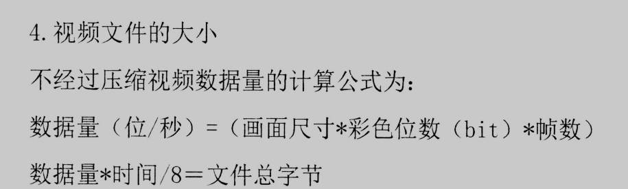

- 操作系统的最小调度单位是进程

### 操作系统

分时系统的特点：同时性 交互性 独立性 及时性
CMOS 常指保存计算机基本启动信息（如日期、时间、启动设置等）的芯片
RAM 和 ROM 区别 RAM 相当于内存 是一种只读存储器，其内容在生产时被写入并且通常不能被修改。ROM 是一种易变存储器，可以被计算机随时读取和写入
ｃａｃｈｅ分为多级缓存　用于缓解处理器和主存之间的速度问题　 L1 L2 L3 越靠近处理器 速度越高

- 进程 = PCB+数据段+程序段
  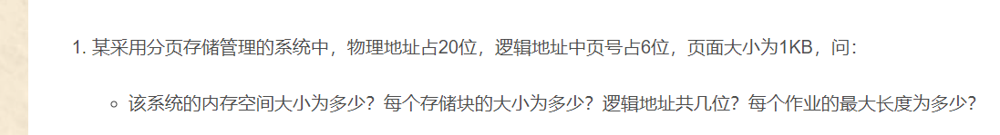
  页号+页内偏移= 逻辑地址
  页号为可以存放页面的数量
  页内偏移为页的大小
  物理地址为内存实际空间大小
  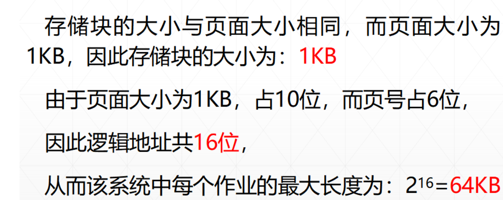

- 分区存储管理

1. 固定分区
2. 可变分区：首次适应算法 从上一次分配的地址接下去分配， 外部碎片
   最佳适应算法 找最小的区域进行分配 内部碎片 分配速度慢
   最坏适应算法 先使用最大的空闲区域进行分配 内部碎片

- 设备管理的缓存技术
  通道技术
  DMA 技术
  使用软件或硬件的缓冲技术
  spooling 技术是使独占使用的设备变成多台虚拟设备的一种技术

- 磁盘调度
  先来先服务
  最短寻道优先
  电梯调度
  循环扫描
  最近未使用
  多级反馈

---

防火墙 是一个组织把内部网络和外部网络隔离开的软件和硬件的组合，根据访问策略允许某些分组通过而拒绝某些分组
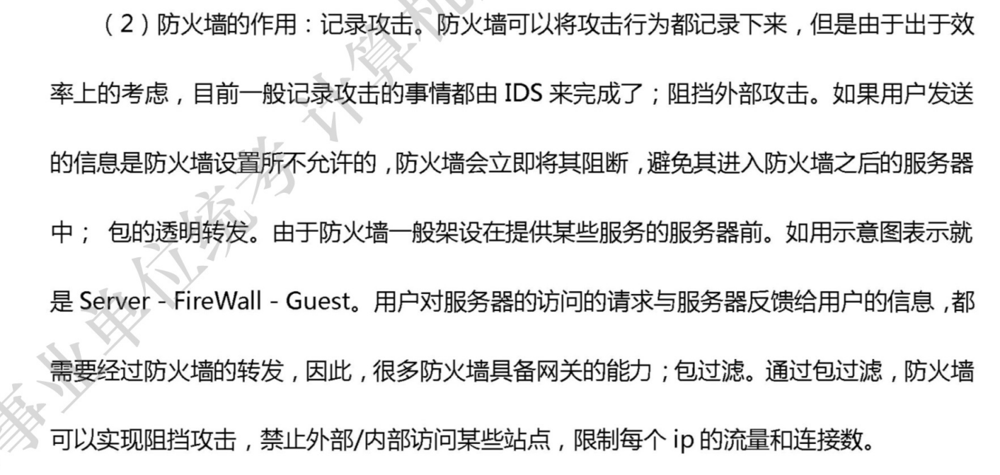

- 文件目录
  树形目录结构是目前最常用的目录结构，因为它具有如下优点：
  (1)解决了文件的重名问题。
  (2)有利于文件的分类。
  (3)提高了文件的检索速度。
  (4)能进行存取权限的控制。

- 什么是物联网

- 机房硬件选择标准：机房本身硬件要求要达标，机房选址、供配电、 空调系统、 监控系统、 等级、网络安全设备齐全、带宽有保证等；机房管理要严格：人员和设备进出入管理；人员配备要齐全：管理人员和运维人员；
  单位自我定期检查：确保数据同步和数据备份正常，做好日志记录

- 不同算法特点
- 贪心算法：它采取一种贪心策略，每一步都选择当前状态下的最优解，希望通过局部最优的选择最终达到全局最优解。无后效性

- TCP/IP 协议特点

- 在 B/S 架构中，系统标准的三层架构 包括：表现层、业务层、持久层。
  在 B/S 架构中，主要业务逻辑在服务器端实现，极少数事务逻辑在浏览器中实现，减轻了客户端的压力。因此，B/S 架构被认为是瘦客户端。B/S 架构的系统无须特别安装，只有 Web 浏览器即可。同时，B/S 架构较 C/S 架构的应用维护和升级有较大的便利。
  C／S 结构作为目前比较成熟的技术，虽然有着能处理大量数据、响应速度快和交互性强等优点。无法实现快速部署的安装和配置，缺乏通用性
- 数据恢复策略

  - 是否有数据备份，是否能回滚执行操作，借助第三方专业人员修复数据

- 网络平台的防范攻击
  - 网络攻击 ： 主机发现 端口扫描 操作系统检测 漏洞扫描。
    防范方法： 关闭闲置端口，使用 NAT 屏蔽内网主机地址，限制外网和内网通信，设置防火墙严格进出分组 过滤不必要的 ICM 报文，使用入侵检测系统及时扫描攻击行为。
  - 网络监听 分组嗅探器 交换机毒化 ARP 欺骗
    防范：使用交换机而不是用集线器，交换机具有一定的安全功能
  - 拒绝服务 DOS 攻击通过消耗网络和系统的资源导致网络过载
    防范：利用防火墙进行恶意分组过滤，在入口路由器进行源端过滤 追溯攻击源

### 状态图

主要定义初始状态 中间状态 和终止状态
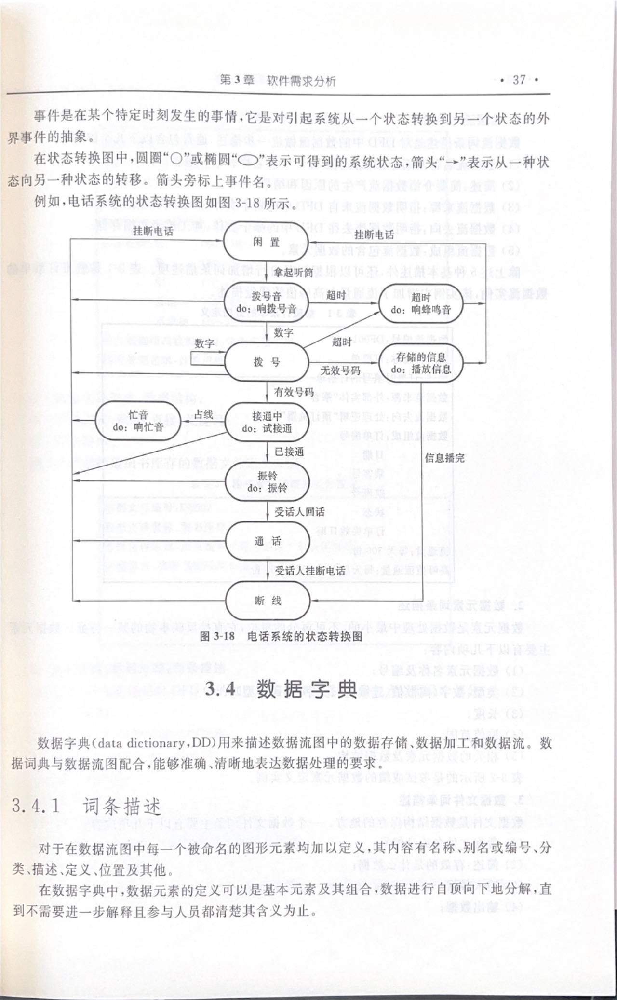

- DNS
- P2P

### 热点消息

- 云计算 实现物联网的核心基于互联网的计算模式，通过网络提供按需的计算资源和服
- 云存储
- 深度学习
- 元宇宙
- 物联网
  关键技术：RFID 技术
- 大数据
  数据采集
  数据清洗
  数据存储
- 人工智能
- 大规模语言模型

- 数据预处理主要包括四个部分：数据清理、数据集成、数据转换、数据规约

### 最短路径算法

Dijkstra 算法,一种贪心算法，找到从该点到其他所有目标的最短距离，权值不能为负数
floyd 算法 通过在节点之间增加中间节点的方式，若得到的路径比源路径短便替换源路径。
可以有负数

### 哈夫曼树

节点总数 2n-1

### 工伤

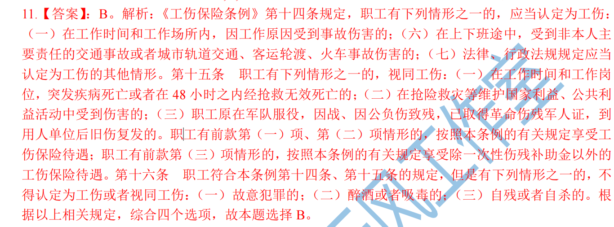

###

基期比重

### 图像

图像压缩：有损压缩，将相同或相似的图像信息进行归类并用较少的数据量描述原始数据信息
经常使用的无损压缩方法有 Shannon-Fano 编码、Huffman 编码、游程（Run-length）编码，LZw（Lempel-Ziv-Welch）编码和算术编码等。
有损压缩：利用人眼的视觉特性有针对性地简化不重要的数据。常见的有损压缩方法有：PCM（脉冲编码调制）、预测编码、变换编码、插值和外推法、统计编码、矢量量化和子带编码等。

### DNS 域名解析

DNS 是互联网上作为域名和 IP 地址相互映射的一个分布式数据库
域名解析过程：先向本地进行域名服务器发送解析查询请求，若本地域名解析器没有对应的 IP 地址向根域名解析器发送递归查询请求。
根域名解析器会向本地域名解析器发送顶级域名服务器的地址，本地域名解析器在向顶级域名服务器发送查询请求，询问对应的权威域名服务器地址，顶级域名服务器返回权威域名服务器地址，本地解析器向权威域名服务器发送请求并将查到的 IP 地址返回给本地域名解析器，最后本地域名解析器保存 IP 地址
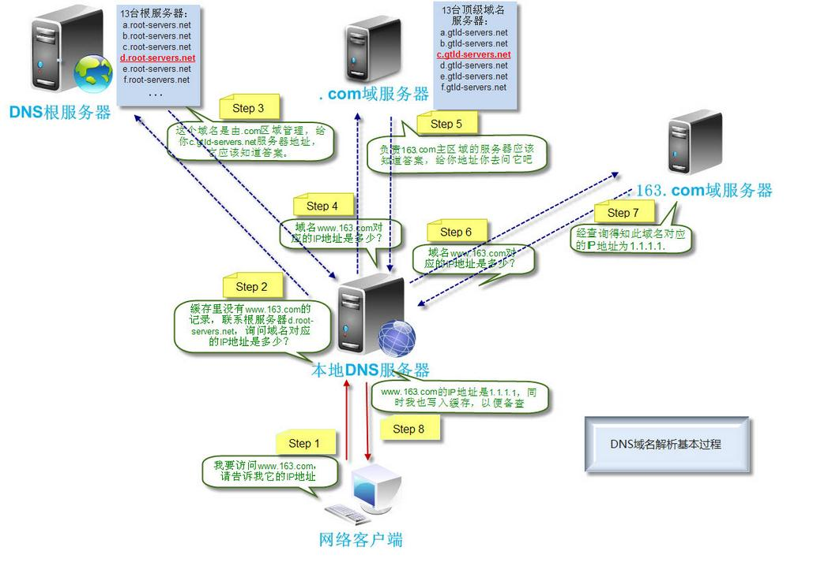

### 数据库

关系的完整性约束：实体 、 参照 、用户定义完整性
候选码 ：该属性组中能够唯一标识一个元组的属性
主码：选定一个候选码为主码 相当于主键
主属性： 候选码
全码：元组的所有属性都是候选码

- 范式：
  第一范式： 要求关系模式中的每个属性都是原子的，
  第二范式：每个非主属性完全依赖于候选键。
  不依赖于第二范式 产生插入异常 删除异常和修改复杂
  第三范式：且每个非主属性不能传递依赖于候选键

- 数据库故障
  系统内部故障
  病毒
  硬件故障

- 数据恢复
  建立冗余，方法数据转存和登记日志

- 恢复策略
  利用系统恢复日志对数据库自动进行恢复
  介质错误进行重装数据库，根据日志重做数据 redo 和 undo

- 图片大小计算
  分辨率 * 3*位深/8 B
  DPI = 像素/英寸

### 加密算法

### 海明码

利用奇偶性校验码距最小 2n+1

- 设备管理：程序查询 cpu 会不断中断和 IO 进行串行工作
  中断 可以并行
  DMA 不需要 cpu 干预 IO 操作可并行工作。

### 入侵检测系统

网络映射，端口扫描 Dos 攻击 蠕虫和病毒

# 行测

- 推理判断：

  - 充分条件 a->b
    如果（假如/一旦/若）......那么/则......
    只要......就......
    整体化表达，如：所有（凡是/凡/任何/每一个）......都......；......是......
    绝对化表达，如：......就......；......则......；......一定......；......离不开......

  - 必要条件：
    b->a
    只有......才...... 翻译是才的内容推只有的内容。
    2）除非......否则不......
    这五个字构成了逻辑连接词，一个字都不能少，大家需要把“不”字从内容里面剥离出来，如果把“不”字算到内容里面，翻译就会出现错误。
    （3）必要条件式表达：......是......的必要条件（先决条件/基础/前提/必要假设）；
    ......是......比不可少的。
    谁是必要条件，箭头就指向谁。

以上三类特征句式都可以翻译为：后 → 前，即：后件 → 前件。

推理由 A→B，可得\B→\A
由 A→B，B→C，可得：A→C
